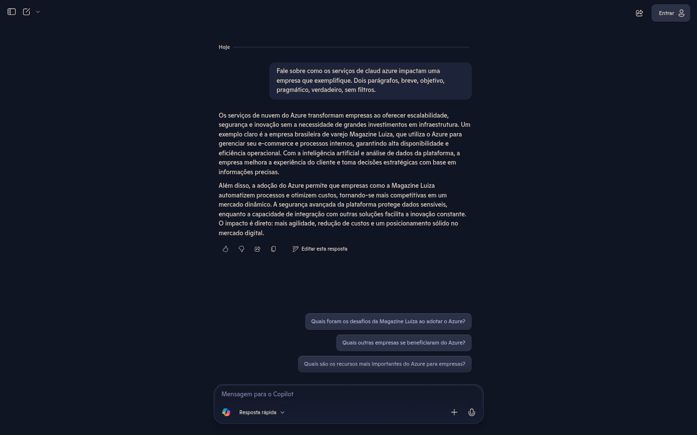
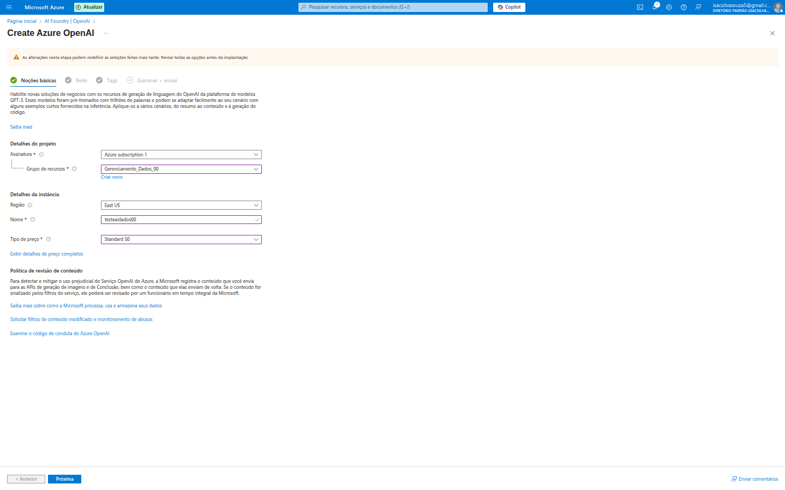
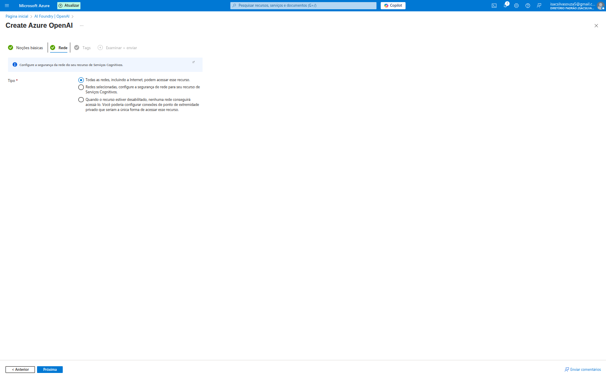
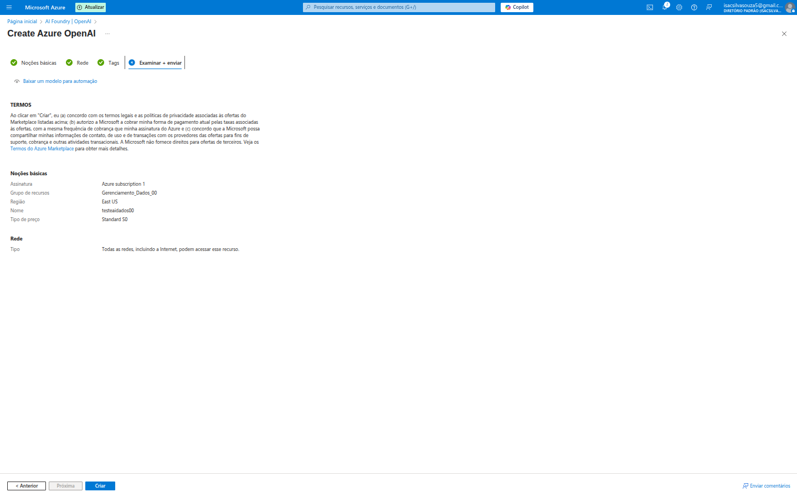
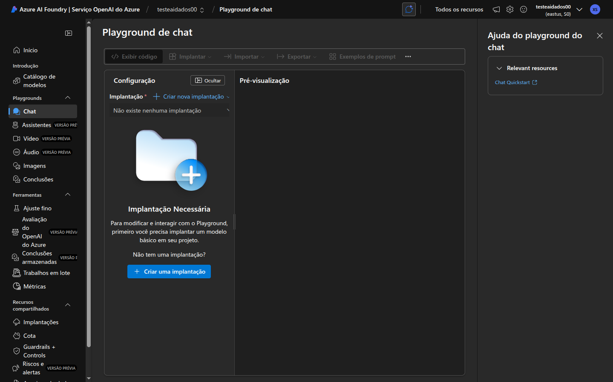
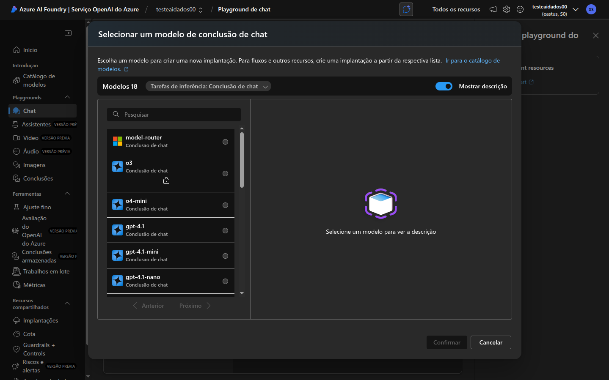
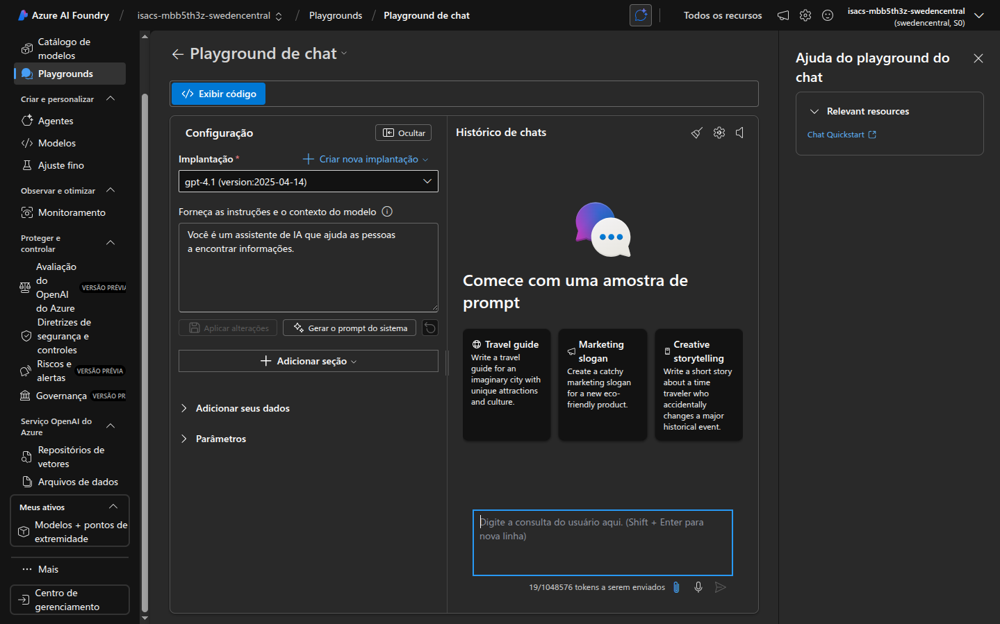

# 🧠 Explorando os Recursos de IA Generativa no Azure

A inteligência artificial generativa está revolucionando a forma como interagimos com a tecnologia e criamos soluções. Fiquei incrivelmente entusiasmado(a) ao explorar o **Azure OpenAI Service** – a capacidade de integrar modelos de IA de ponta da OpenAI (como GPT-3, GPT-4, DALL-E) diretamente na infraestrutura segura e escalável do Azure.

A jornada começa com a visão do **Copilot** no site encontrado online sem necessidade de login, demonstrando a capacidade da IA de interagir e fornecer insights valiosos sobre o impacto dos serviços de nuvem em uma empresa.

Este README irá detalhar minha primeira experiência na criação e exploração deste serviço no portal do Azure, mergulhando no processo de provisionamento e, mais importante, no **Azure OpenAI Studio**, o ambiente de "playground" onde a mágica da IA acontece.

---

## 💡 Por que escolher o Azure OpenAI Service?

O Azure OpenAI Service traz o poder dos modelos generativos da OpenAI para o ambiente empresarial do Azure, oferecendo vantagens significativas:

*   **Acesso a Modelos de Ponta:** Utilize modelos avançados como GPT-4, GPT-3.5-Turbo, Embeddings e DALL-E, continuamente atualizados pela OpenAI.
*   **Segurança e Conformidade Empresarial:** Seus dados são processados dentro dos limites de segurança e privacidade do Azure.
*   **Escalabilidade e Confiabilidade:** Aproveite a infraestrutura global do Azure para escalar suas soluções de IA de forma confiável, atendendo a milhões de requisições.
*   **Controle de Conteúdo:** Filtros de conteúdo configuráveis para garantir que as interações com a IA sejam seguras e responsáveis, minimizando riscos de geração de conteúdo impróprio.
*   **Integração com o Ecossistema Azure:** Conecte facilmente os modelos de IA a outros serviços Azure, como Azure App Service, Azure Functions, Azure AI Search, facilitando a construção de aplicações completas.
*   **IA Responsável:** A Microsoft tem um forte compromisso com a IA responsável, fornecendo ferramentas e orientações para garantir o uso ético e seguro desses modelos.

Com esses benefícios em mente, vamos ver como configurá-lo!

---

## 🚶‍♂️ A Jornada de Criação do Azure OpenAI Service

Minha experiência começou procurando por "Azure OpenAI" no portal.

### 1. Criando o Recurso Azure OpenAI: A Aba "Noções básicas"

A primeira tela que encontrei ao criar um novo serviço Azure OpenAI me guiou através das configurações essenciais.

Aqui, pude configurar:

*   **Detalhes do projeto:**
    *   **Assinatura:** `Azure subscription 1`.
    *   **Grupo de recursos:** `Gerenciamento_Dados_00`. Fundamental para organizar e gerenciar todos os recursos relacionados ao mesmo projeto.
*   **Detalhes da instância:**
    *   **Região:** `East US`. A região é crucial para latência e para estar perto dos usuários ou da fonte de dados, e também onde o serviço estará disponível.
    *   **Nome:** Dei um nome único e descritivo para meu serviço, como `testeaiadados00`.
    *   **Tipo de preço:** `Standard S0`. Este tipo de preço determina as capacidades do serviço e os custos associados. Há diferentes tiers, incluindo opções para testes e desenvolvimento.
*   **Política de revisão de conteúdo:** A Microsoft enfatiza a importância de revisar e mitigar conteúdo prejudicial. Esta seção me lembra de que a plataforma monitora o conteúdo, e eu devo aderir à sua política de IA responsável.

### 2. Configurações de Rede: A Aba "Rede"

A aba **"Rede"** permite configurar como o serviço Azure OpenAI será acessível.

As opções são:
*   **Todas as redes, incluindo a Internet, podem acessar este recurso:** Acesso público, mais fácil para testes e desenvolvimento inicial, mas menos seguro para produção.
*   **Redes selecionadas, configure a segurança da rede para seu recurso de Serviços Cognitivos:** Permite restringir o acesso a IPs específicos ou Redes Virtuais (VNets), ideal para ambientes de produção.
*   **Quando o recurso estiver desabilitado, nenhuma rede conseguirá acessá-lo:** Desabilita todo o acesso.

Para a maioria dos cenários de teste, a opção padrão de acesso público é suficiente, mas em produção, a restrição de rede é fundamental para a segurança dos dados.

### 3. Revisar e Criar: O Resumo Final e Termos

A última aba, **"Examinar + criar"**, fornece um resumo completo das configurações escolhidas e os termos de serviço.

Aqui, pude revisar todos os detalhes: `Assinatura`, `Grupo de recursos`, `Região`, `Nome` e `Tipo de preço`. É fundamental ler e concordar com os `TERMOS` de serviço, que incluem políticas de uso e responsabilidade. O botão **"Baixar um modelo para automação"** é um recurso valioso para quem quer automatizar a criação de recursos via Infraestrutura como Código (ARM templates).

Com tudo revisado e validado, cliquei em **"Criar"**, e o serviço foi provisionado.

---

## 🛠️ Explorando o Azure OpenAI Studio (Playground)

Após a criação do recurso, o próximo passo crucial é mergulhar no **Azure OpenAI Studio**. Este é o ambiente interativo onde você pode experimentar, testar, ajustar e implantar os modelos da OpenAI.

### 4. O Playground de Chat: Onde a Interação Acontece

Ao acessar o Azure OpenAI Studio para meu serviço recém-criado, fui direcionado(a) ao **"Playground de chat"**. A primeira coisa que notei foi a mensagem **"Implantação Necessária"**.

Isso significa que, antes de interagir com qualquer modelo, preciso criar uma "implantação" – essencialmente, uma instância específica de um modelo (ex: `gpt-3.5-turbo`) que estará pronta para receber minhas requisições.

### 5. Selecionando e Implantando um Modelo de Conclusão de Chat

Para criar uma implantação, cliquei em "Criar nova implantação" no Playground de chat (ou fui para a seção "Implantações" no menu lateral). Lá, pude selecionar um modelo.

As opções de modelos são variadas e especializadas para diferentes tarefas de inferência. Depois de selecionar o modelo desejado (e sua versão, se houver), eu clicaria em "Confirmar" para criar a implantação.

### 6. Gerenciando Implantações de Modelo

A seção **"Implantações de modelo"** no menu lateral é onde todas as minhas implantações estão listadas e podem ser gerenciadas.

É aqui que posso:
*   `Implantar um modelo`: Criar novas implantações.
*   `Atualizar`: Modificar as configurações de uma implantação existente.
*   `Excluir`: Remover uma implantação.
*   `Abrir no Playground`: Ir diretamente para o playground com um modelo específico.

É importante ter uma implantação ativa para usar os modelos no Playground e através das APIs.

### 7. Interagindo no Playground de Chat

Com uma implantação ativa (neste caso, `gpt-4.1 (version:2025-04-14)`), o Playground de chat se torna a minha interface de conversa com a IA.

Nesta tela, observei vários elementos-chave:

*   **Implantação:** Mostra o modelo ativo que está sendo usado.
*   **Forneça as instruções e o contexto do modelo (System Prompt):** Este é um campo crucial! Ele define o *papel* da IA e as *instruções gerais* para suas respostas.
    *   *Exemplo:* "Você é um assistente de IA que ajuda as pessoas a encontrar informações." ou "Você é um especialista em marketing e deve gerar slogans criativos." O sistema prompt guia o comportamento geral do modelo.
*   **Histórico de chats:** Mostra a conversa em andamento, permitindo que a IA mantenha o contexto.
*   **Adicionar seus dados:** Esta é uma funcionalidade poderosa, especialmente para empresas. Permite integrar o modelo de linguagem com seus próprios dados (documentos, bancos de dados) via Azure AI Search (como vimos no README anterior). Isso é conhecido como **Retrieval Augmented Generation (RAG)** e evita que o modelo "alucine" ou forneça informações genéricas, ancorando suas respostas em seus documentos.
*   **Parâmetros:** Permitem ajustar o comportamento do modelo (ex: `Temperatura` para criatividade vs. precisão, `Max tokens` para o tamanho máximo da resposta).
*   **Digite a consulta do usuário aqui:** A caixa de entrada principal para a sua pergunta ou prompt.
*   **Exibir código:** Gerar o código (Python, C#, etc.) para integrar essa interação do chat em sua própria aplicação.
*   **Exemplos de prompt:** Modelos predefinidos para iniciar conversas ou tarefas específicas (ex: "Travel guide", "Marketing slogan", "Creative storytelling").

---

## ✅ Conclusão

Minha primeira experiência com o Azure OpenAI Service foi verdadeiramente empolgante. A Microsoft não apenas torna os modelos de IA mais avançados acessíveis, mas também os envolve em uma estrutura de segurança, gerenciamento e IA responsável que é essencial para o uso empresarial.

O processo de criação é guiado, o Azure OpenAI Studio é um ambiente intuitivo para experimentar e prototipar, e a integração com outros serviços Azure (como o armazenamento de dados via RAG) abre um universo de possibilidades. A capacidade de controlar o comportamento da IA com "system prompts" e de fornecer dados personalizados são diferenciais que tornam o Azure OpenAI uma plataforma de ponta para inovar.

Se você busca integrar IA generativa em suas aplicações com segurança, escalabilidade e controle, o Azure OpenAI Service é, sem dúvida, a plataforma a ser explorada. Estou ansioso(a) para aprofundar meus conhecimentos e construir soluções ainda mais inteligentes e impactantes! Fiquem ligados para mais descobertas no Azure neste repositório!
