# 🔍 Encontrando Tudo: Uma Jornada com o Azure AI Search (e seus Aliados IA!)

Se você, como eu, já se deparou com a necessidade de oferecer uma experiência de busca inteligente em suas aplicações – que vá além de simples filtros e realmente entenda a intenção do usuário e o conteúdo dos dados – então o **Azure AI Search** é o serviço que você precisa conhecer.

Imaginem ter um sistema que não apenas encontra palavras-chave, mas também compreende o contexto, extrai informações relevantes de documentos (mesmo que sejam imagens!) e oferece sugestões úteis. Isso é o que o Azure AI Search, especialmente quando integrado com outras capacidades de IA do Azure, nos permite construir.

Este README irá documentar minha primeira experiência na criação e configuração deste serviço no portal do Azure, incluindo seus aliados essenciais como as Contas de Armazenamento para os dados e, por contexto, os Serviços Cognitivos do Azure que potencializam sua inteligência.

---

## 💡 Por que escolher o Azure AI Search?

O Azure AI Search (anteriormente conhecido como Azure Cognitive Search) permite adicionar uma rica experiência de busca a suas aplicações, sem a complexidade de construir um motor de busca do zero. Aqui estão os motivos para considerá-lo:

*   **Pesquisa Full-Text Avançada:** Vai além da busca básica, oferecendo relevância, classificação, facetamento e sugestões automáticas.
*   **Capacidades de IA Integradas (Cognitive Skills):** Esta é a grande estrela! Ele pode processar dados não-estruturados (documentos, imagens, áudios) usando IA para extrair informações valiosas como reconhecimento óptico de caracteres (OCR), análise de sentimento, extração de frases-chave, detecção de idioma e muito mais.
*   **Escalabilidade e Confiabilidade:** Como um serviço Azure, ele escala sob demanda para lidar com grandes volumes de dados e altas cargas de consulta, com alta disponibilidade.
*   **Experiência de Usuário Aprimorada:** Permite que seus usuários encontrem o que precisam de forma mais rápida e eficiente, melhorando a satisfação e a produtividade.
*   **Flexibilidade:** Oferece APIs REST, SDKs para diversas linguagens e integra-se facilmente com outros serviços Azure.
*   **Vector Search (Busca Vetorial):** Recurso crescente em IA, permite buscar por similaridade semântica (o "significado" do texto), essencial para aplicações de IA generativa (como RAG - Retrieval Augmented Generation).

**Exemplos de Aplicações:**
*   **E-commerce:** Clientes encontram produtos mais facilmente com filtros avançados e busca por imagem.
*   **Portais de Conhecimento:** Funcionários ou clientes encontram informações relevantes em documentos internos, manuais e FAQs.
*   **Aplicativos de Mídia:** Busca inteligente em catálogos de vídeos, músicas ou artigos de notícias.
*   **Análise de Dados:** Indexação de logs e dados para análise rápida e detecção de padrões.

---

## 🚶‍♂️ A Jornada de Criação do Azure AI Search

Minha experiência começou com a navegação para a seção de serviços de pesquisa no portal.

### 1. Criando o Serviço de Pesquisa: A Aba "Básico"

A primeira tela que encontrei ao criar um novo serviço de pesquisa me guiou através das configurações essenciais.

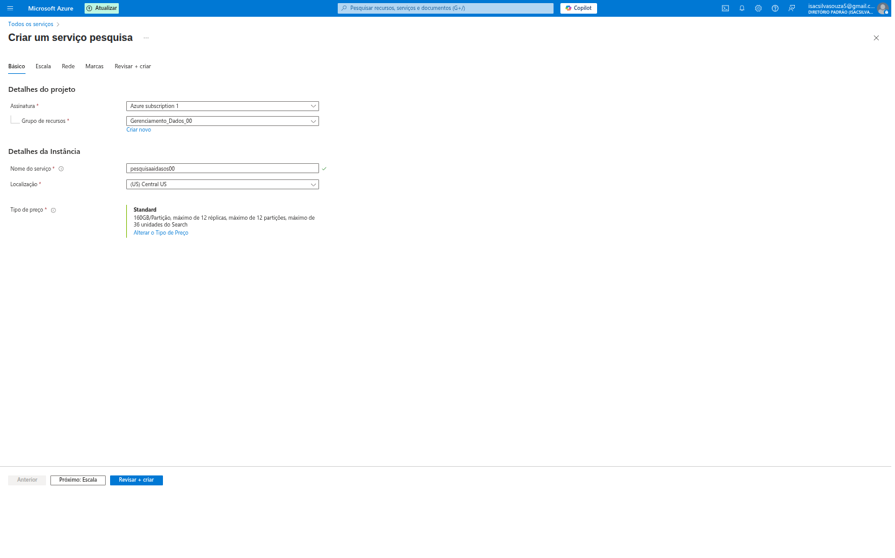

Aqui, pude configurar:

*   **Detalhes do projeto:**
    *   **Assinatura:** `Azure subscription 1`.
    *   **Grupo de recursos:** `Gerenciamento_Dados_00`. Mais uma vez, a importância de organizar os recursos em grupos lógicos!
*   **Detalhes da instância:**
    *   **Nome do serviço:** Dei um nome único e descritivo, `pesquisaaibasico00`.
    *   **Localização:** `US Central US`. A região é fundamental para a latência e para estar perto dos usuários ou da fonte de dados.
    *   **Tipo de preço:** Este é um ponto crucial que impacta o custo e as capacidades. Na imagem, a opção padrão é **Standard**, que já indica suas capacidades: "100GB Partição, máximo de 12 réplicas, máximo de 12 partições, máximo de 36 unidades de Search".

### 2. Selecionando o Tipo de Preço: Entendendo a Escala

Ao clicar em "Alterar o Tipo de Preço", uma nova janela se abriu, exibindo as diversas opções de SKU (Unidade de Manutenção de Estoque), cada uma com diferentes capacidades e custos.

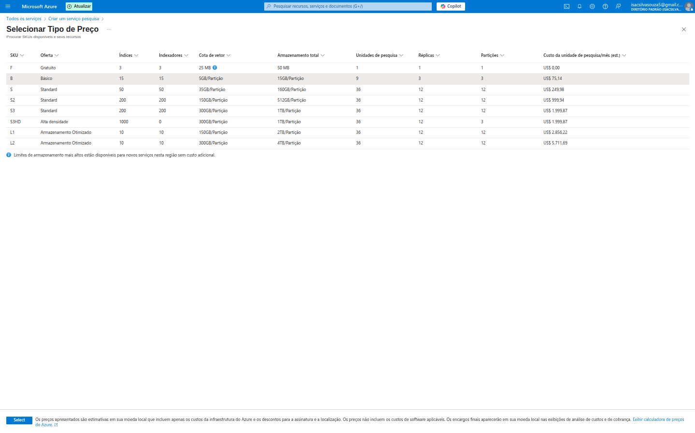

Aqui, pude ver opções como:
*   **Free (Grátis):** Perfeito para desenvolvimento e testes. Oferece 3 índices, 3 indexadores, 25 MB de cota de vetor e 50 MB de armazenamento. **Custo: US$ 0,00.**
*   **Basic (Básico):** Para cargas de trabalho menores. Mais índices, indexadores e armazenamento, com custo acessível.
*   **Standard (S1, S2, S3):** Para cargas de trabalho de produção. Oferece escalabilidade por meio de réplicas (para alta disponibilidade e maior throughput) e partições (para maior armazenamento e throughput de indexação).
*   **High density (S3HD):** Para cenários com muitos índices menores.
*   **Armazenamento Otimizado (L1, L2):** Para cenários que precisam de muito armazenamento.

**Pontos importantes para observar:**
*   **SKU / Oferta:** O nível do serviço.
*   **Índices:** Quantos índices de pesquisa você pode criar. Cada índice é uma coleção de documentos pesquisáveis.
*   **Indexadores:** Ferramentas que automatizam a ingestão de dados de fontes externas (como Blob Storage, SQL Database).
*   **Cota de vetor:** Importante para busca vetorial.
*   **Armazenamento total:** Capacidade de armazenamento de documentos.
*   **Réplicas:** Para alta disponibilidade e balanceamento de carga de consultas.
*   **Partições:** Para armazenamento e throughput de indexação.
*   **Custo da unidade de pesquisa (mês net.):** O preço mensal por unidade.

Para a maioria dos testes e aprendizado, o **Free** tier é ideal.

### 3. Revisar e Criar o Serviço de Pesquisa

A última aba, **"Revisar + criar"**, fornece um resumo completo das configurações escolhidas e uma estimativa de custo mensal.

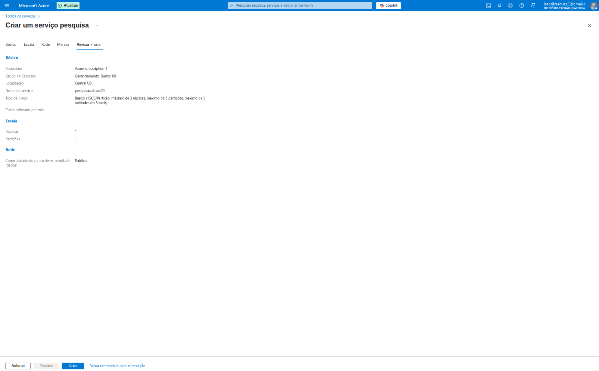

Aqui, pude confirmar os detalhes básicos, a escala (réplicas e partições) e a conectividade de rede (pública). O "Custo estimado por mês" é uma funcionalidade vital para controle orçamentário. Ao clicar em "Criar", o serviço de pesquisa é provisionado.

---

## 🤝 Serviços Aliados Essenciais

Para que o Azure AI Search funcione em todo o seu potencial, ele frequentemente precisa de outros serviços Azure. Nas imagens fornecidas, vemos a criação de um **Serviço Cognitivo** e uma **Conta de Armazenamento**, que são parceiros comuns.

### 4. Criando um Serviço Cognitivo

Embora não diretamente o Azure AI Search em si, um **Serviço Cognitivo** separado pode ser provisionado para fornecer habilidades de IA mais genéricas, que podem ser orquestradas pelo Search para enriquecer os dados.

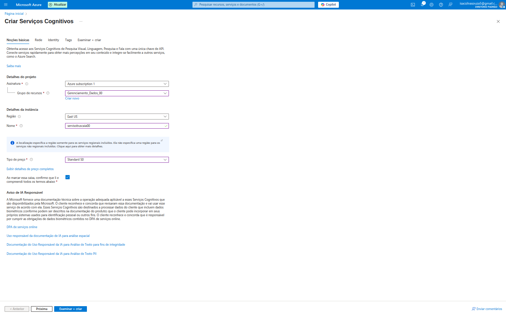

Este serviço permite acesso a diversas APIs de IA (visão, fala, linguagem, decisão). A criação é similar:
*   **Assinatura** e **Grupo de recursos**.
*   **Região** e **Nome** do serviço (ex: `servicoaiacao00`).
*   **Tipo de preço** (também com opções Free e Standard).

É importante notar a seção "Aviso de IA Responsável", enfatizando o compromisso da Microsoft com o uso ético da IA.

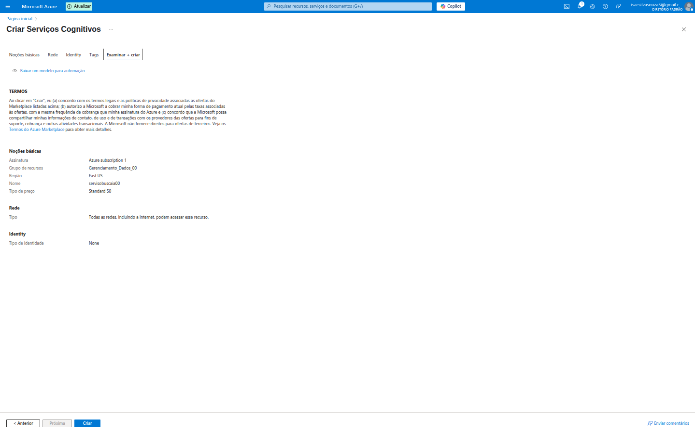

A aba "Examinar + criar" resume as configurações, incluindo que o acesso de rede será público por padrão.

### 5. Criando uma Conta de Armazenamento (Onde os Dados Vivem)

A **Conta de Armazenamento** é onde seus documentos, imagens e outros dados residem antes de serem indexados pelo Azure AI Search. É uma peça fundamental para importar dados.

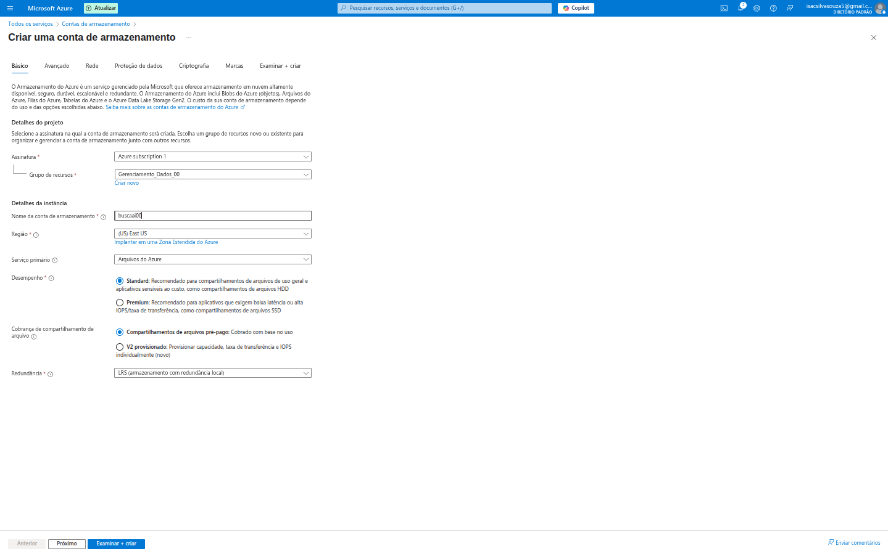

Na aba "Básico", as configurações chave incluem:
*   **Assinatura** e **Grupo de recursos**.
*   **Nome da conta de armazenamento:** Um nome único globalmente (ex: `buscai00`).
*   **Região:** Onde o armazenamento físico estará localizado.
*   **Desempenho:** `Standard` (para uso geral) ou `Premium` (para IOPS alto).
*   **Redundância:** Crucial para durabilidade dos dados (ex: `LRS - armazenamento com redundância local`, `GRS - geográfica`).

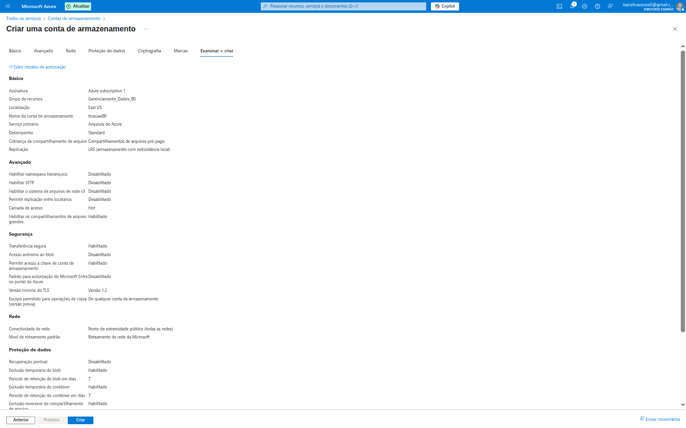

A aba "Examinar + criar" sumariza todas as configurações, incluindo opções avançadas como `Transferência segura` e `Nível de acesso público`.

### 6. Configurando a Conta de Armazenamento: Criando um Contêiner

Após a criação da conta de armazenamento, é preciso criar um **contêiner de Blob** com acesso anônimo (como mostra a imagem) dentro dela para armazenar os documentos que o Azure AI Search irá indexar.

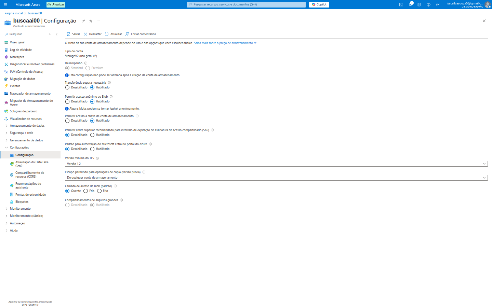

Esta imagem mostra a tela de configurações da conta de armazenamento. É aqui que você pode gerenciar opções como segurança, acesso e o custo.

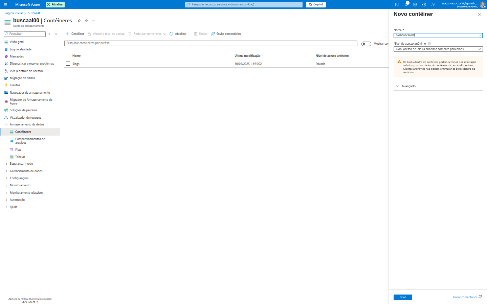

Na seção "Contêineres", eu pude criar um **novo contêiner** (ex: `bobbuscaai00`). A configuração de `Nível de acesso anônimo` deve ser `Privado` para garantir a segurança dos dados.

---

## 📤 Importando Dados para o Azure AI Search

Com o serviço de pesquisa e a conta de armazenamento prontos, o próximo passo é importar os dados para o índice de pesquisa. O Azure AI Search possui um assistente "Importar dados" para facilitar isso.

### 7. Conectando-se à Fonte de Dados (Blob Storage)

A primeira etapa do assistente "Importar dados" é conectar-se à fonte de dados.

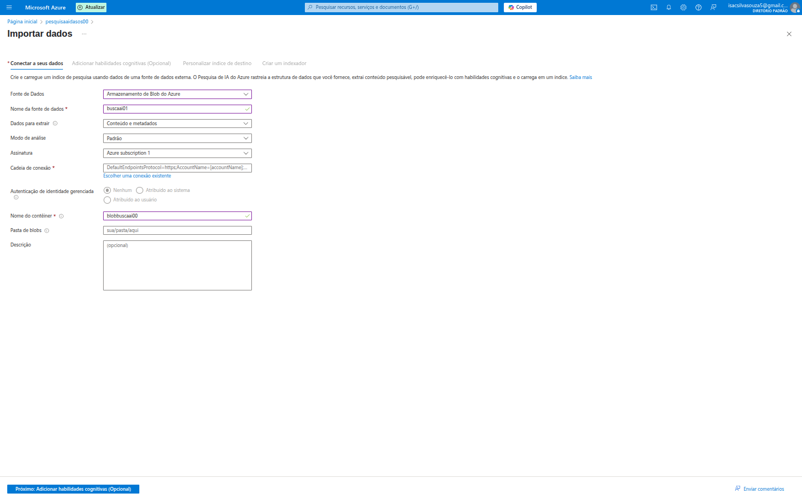

Aqui, configurei:
*   **Fonte de dados:** `Armazenamento de Blob do Azure`.
*   **Nome da fonte de dados:** `buscaai00`.
*   **Dados para extrair:** `Contexto e metadados` (importante para processar documentos com IA).
*   **Cadeia de conexão:** Conecta ao Blob Storage.
*   **Nome do contêiner:** `bobbuscaai00` (o contêiner que criei anteriormente).
*   **Pasta de dados:** Se os documentos estiverem em uma subpasta específica dentro do contêiner.

## 🔎 Explorando a Pesquisa: Testando a Inteligência

Com o índice populado, a melhor forma de testar é usar o "Explorador de pesquisa" (Search Explorer) no portal do Azure.

### 9. Testando a Pesquisa no Explorador

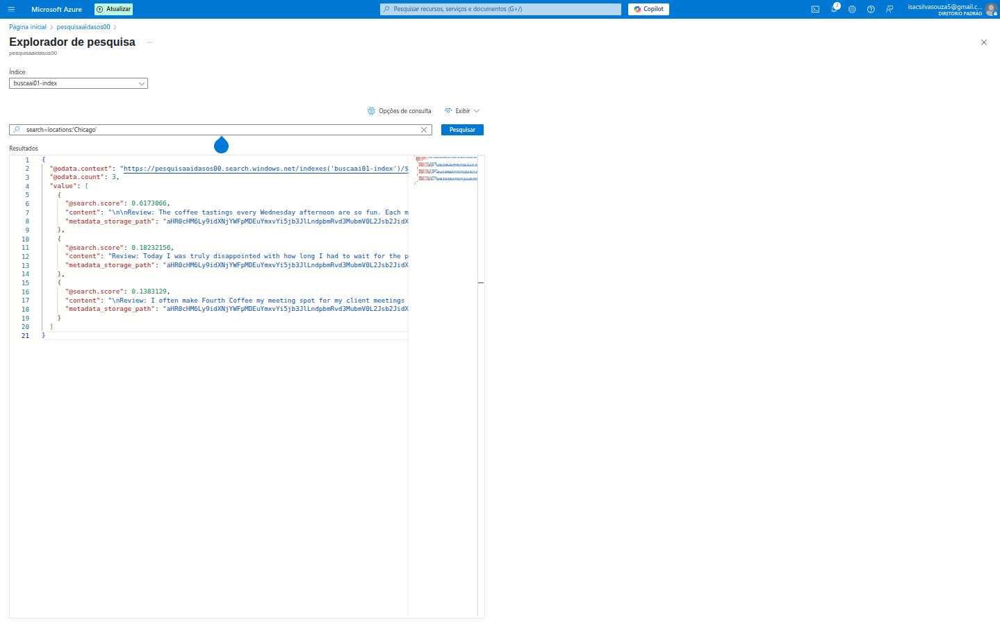

Nesta interface, posso:
*   Selecionar o `Índice` que quero testar (`buscaai00-index`).
*   Digitar uma `Consulta de pesquisa`. Na imagem, a consulta é `search=locations:'Chicago'`. Isso significa: "encontre documentos onde a localização é 'Chicago'".
*   Clicar em `Pesquisar` e ver os `Resultados` em formato JSON.

O resultado JSON mostra:
*   `@odata.count`: O número total de documentos encontrados.
*   `search.score`: Um valor que indica a relevância de cada documento para a consulta (quanto maior, mais relevante).
*   `content`: O conteúdo do documento retornado.
*   `metadata_storage_path`: O caminho do documento original no Blob Storage.

Esta ferramenta é fantástica para depurar e entender como suas consultas se comportam e quais documentos são retornados.

---

## ✅ Conclusão

Minha experiência com o Azure AI Search foi um divisor de águas. Ele não é apenas um motor de busca; é uma plataforma completa que integra inteligência artificial para transformar dados brutos em informações pesquisáveis e significativas. A facilidade de configuração, a capacidade de escalar e a integração nativa com o ecossistema Azure o tornam uma escolha poderosa para qualquer aplicação que precise de uma funcionalidade de busca robusta.

Desde a configuração básica de um serviço de pesquisa até a importação de dados de armazenamento e o uso de habilidades cognitivas, o Azure nos oferece todas as ferramentas necessárias para construir experiências de pesquisa de nível profissional.

Estou empolgado(a) para aplicar esses conhecimentos em projetos futuros e explorar ainda mais as capacidades de IA do Azure! Fiquem ligados para mais descobertas e tutoriais neste repositório!
