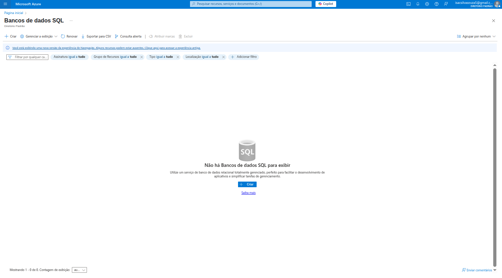
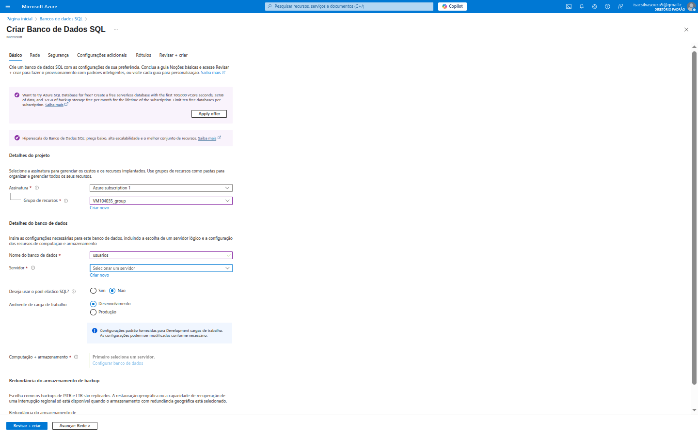
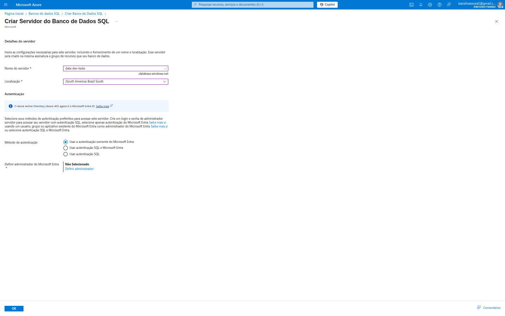
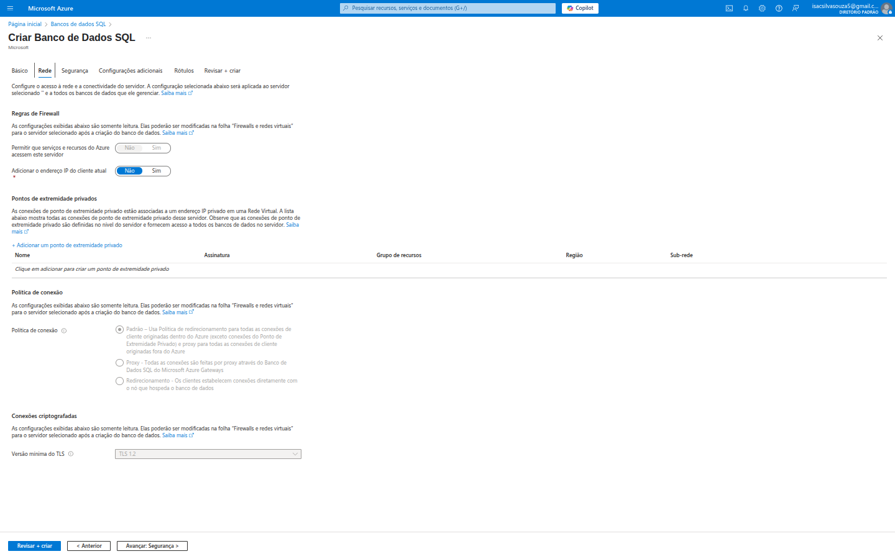
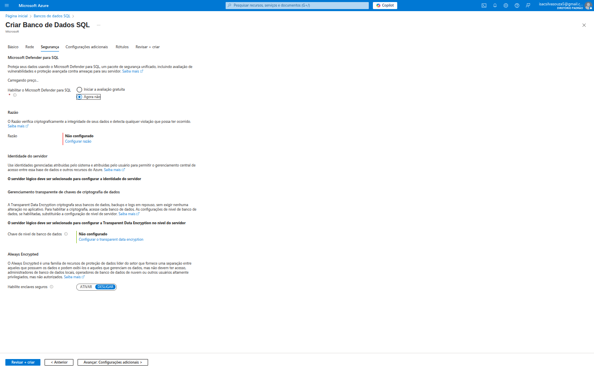
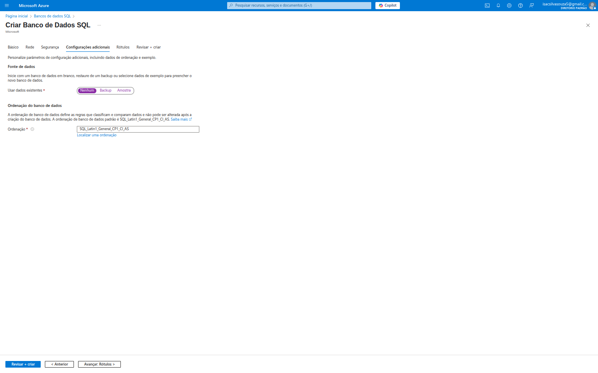
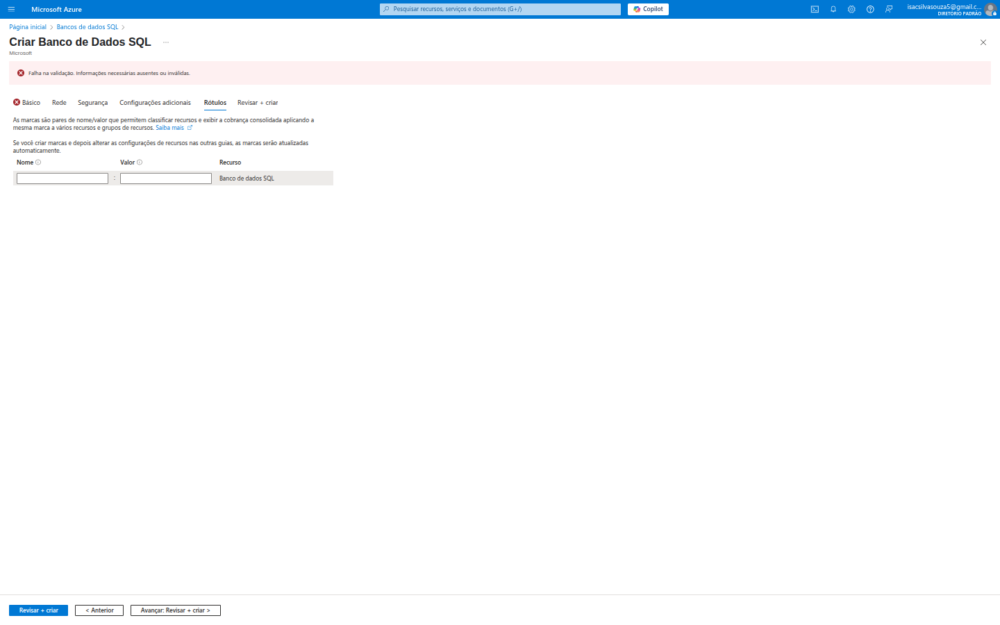
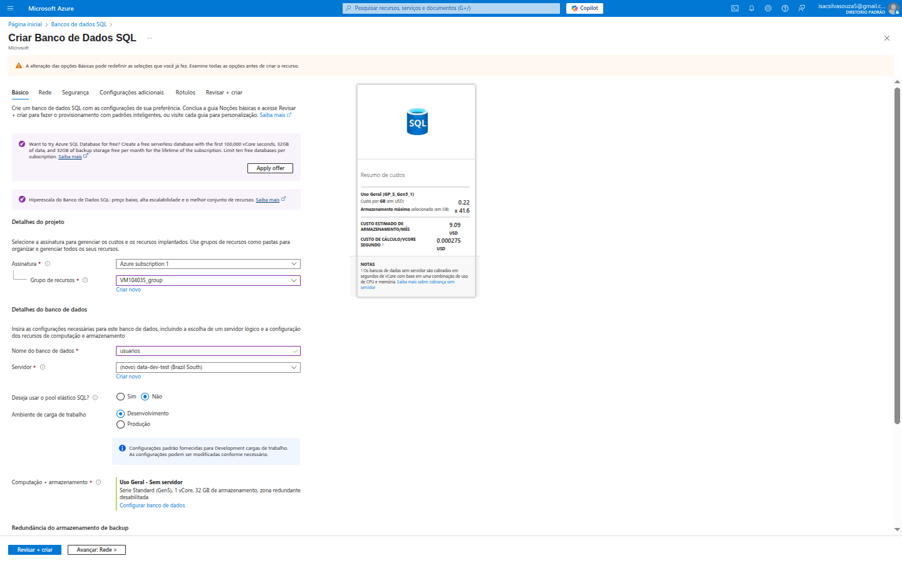

# 💾 Criando um Banco de Dados SQL no Azure

Olá, devs! Se você, como eu, está começando a explorar o vasto universo do Microsoft Azure e precisa de um banco de dados relacional confiável, escalável e seguro, você veio ao lugar certo!

Neste guia, vou compartilhar minha jornada inicial pela criação de um Banco de Dados SQL no Azure. O processo é surpreendentemente guiado e oferece uma gama impressionante de opções para atender a diversas necessidades, desde pequenos projetos até aplicações corporativas de grande escala. Vamos mergulhar!

---

## 💡 Por que escolher o Banco de Dados SQL do Azure?

Antes de entrarmos nos detalhes da criação, é importante entender o porquê de o Azure SQL Database ser uma escolha tão poderosa:

*   **Gerenciado pela Microsoft:** Isso significa menos preocupação com a infraestrutura, patches, backups e alta disponibilidade. A Microsoft cuida de tudo isso, liberando você para focar no desenvolvimento.
*   **Escalabilidade e Flexibilidade:** Você pode ajustar a capacidade de computação e armazenamento conforme a demanda, pagando apenas pelo que usa. Isso evita o superprovisionamento e otimiza os custos.
*   **Alta Disponibilidade Integrada:** O Azure SQL Database oferece redundância  garantindo que seu banco de dados esteja sempre disponível, mesmo em caso de falhas.
*   **Segurança Robusta:** Com recursos avançados como detecção de ameaças, criptografia de dados em repouso e em trânsito, e integração com o Microsoft Entra ID (antigo Azure Active Directory), seus dados estarão protegidos.
*   **Otimização de Custos:** Os pools elásticos permitem otimizar os gastos, especialmente para cargas de trabalho intermitentes ou múltiplos bancos de dados com necessidades variadas.
*   **Compatibilidade com SQL Server:** Se você já trabalha com SQL Server, a transição para o Azure SQL Database é fluida, pois ele oferece alta compatibilidade com suas ferramentas e aplicações existentes.

Com esses benefícios em mente, vamos ao passo a passo!

---

## 🚶‍♂️ A Jornada de Criação do Banco de Dados SQL no Azure

Minha experiência começou na seção "Bancos de dados SQL" do portal.

### 1. A Página Inicial dos Bancos de Dados SQL

Ao navegar para `Bancos de dados SQL`, a primeira coisa que vi foi uma tela limpa, indicando que ainda não havia nenhum banco de dados criado.

A mensagem clara me convidou a "Utilizar um serviço de banco de dados relacional totalmente gerenciado, perfeito para facilitar o desenvolvimento de aplicativos ou simplificar tarefas de gerenciamento." O grande botão **"Criar"** é o ponto de partida para essa jornada.

### 2. Iniciando a Criação: O Painel "Básico"

Ao clicar em "Criar", fui direcionado(a) para um assistente de criação em várias abas, começando pela aba **"Básico"**. Esta aba é crucial para definir os detalhes fundamentais do seu banco de dados.

Aqui, pude configurar:

*   **Detalhes do projeto:**
    *   **Assinatura:** Escolhi a `Azure subscription 1`, que é onde os custos serão faturados.
    *   **Grupo de recursos:** Escolhi um grupo de recursos existente (`VM104035_group`). Um **Grupo de Recursos** é um contêiner lógico para agrupar recursos relacionados para uma aplicação. Isso facilita o gerenciamento (ex: você pode deletar todos os recursos de um projeto de uma vez excluindo o grupo de recursos).
*   **Detalhes do banco de dados:**
    *   **Nome do banco de dados:** Dei um nome claro para o meu banco de dados (ex: `usuarios`).
    *   **Servidor:** Este é um ponto importante! Um banco de dados SQL do Azure precisa de um *servidor lógico* para hospedá-lo. Eu tinha a opção de `Selecionar um servidor` existente ou `Criar novo`. Como era minha primeira vez, precisei criar um novo.
    *   **Ambiente de carga de trabalho:** `Desenvolvimento` ou `Produção`. Esta escolha impacta o desempenho e o custo. Para produção, o Azure oferece mais garantias de SLA (Service Level Agreement).
    *   **Computação + armazenamento:** Esta seção define o desempenho e o custo do meu banco de dados. Há diferentes modelos de compra (vCore ou DTU) e camadas de serviço (Propósito Geral, Hiperescala, Negócios Críticos). A opção "Serverless" é muito interessante, pois o banco de dados pode pausar automaticamente quando não está em uso, reduzindo drasticamente os custos.
    *   **Redundância do armazenamento de backup:** Decidi onde os backups do meu banco de dados seriam armazenados para garantir a recuperação em caso de desastre (ex: LRS - localmente redundante, GRS - geograficamente redundante).

### 3. Configurando o Servidor SQL 

Ao selecionar "Criar novo servidor" na aba "Básico", uma nova janela (ou aba) se abriu para configurar o servidor lógico que irá hospedar o banco de dados.

Aqui precisei definir:

*   **Nome do servidor:** Um nome único (ex: `data-dev-teste.database.windows.net`).
*   **Localização:** A região onde meu servidor (e consequentemente, meu banco de dados) será hospedado. Escolhi `South America Brazil South` para ter menor latência para usuários no Brasil. A escolha da região é vital para performance, custos e conformidade com regulamentações de dados.
*   **Autenticação:** As opções eram:
    *   **Usar autenticação somente do Microsoft Entra:** Altamente recomendado para segurança e gerenciamento centralizado de identidades.
    *   **Usar autenticação SQL e Microsoft Entra:** Uma abordagem híbrida.
    *   **Usar autenticação SQL:** Métodos tradicionais de login e senha.
    Eu escolheria a autenticação do Microsoft Entra para uma segurança mais moderna e gerenciável. Eu precisaria `Definir administrador` para ter acesso inicial ao servidor.

### 4. Conectividade e Segurança da Rede: A Aba "Rede"

Após configurar o básico, avancei para a aba **"Rede"**, que trata de como meu banco de dados será acessível e protegido.

As configurações aqui são cruciais:

*   **Regras de Firewall:**
    *   `Permitir que serviços e recursos do Azure acessem este servidor`: Se sim, outros serviços do Azure (como Azure App Service ou Azure Functions) podem se conectar ao banco de dados. Para a maioria das aplicações, isso é necessário.
    *   `Adicionar o endereço IP do cliente atual`: Isso adiciona uma regra de firewall que permite que o meu IP atual (da máquina que estou usando) se conecte ao banco de dados. **Essencial para testes e desenvolvimento inicial**, mas deve ser revisado em produção.
*   **Pontos de extremidade privados:** Uma forma altamente segura de conectar seu banco de dados via uma rede virtual privada, sem exposição à internet pública. **Recomendado para ambientes de produção.**
*   **Política de conexão:** Define como os clientes se conectam. `Redirecionamento` geralmente oferece melhor latência, enquanto `Proxy` é mais simples para certos cenários.
*   **Versão mínima do TLS:** Garante que a comunicação com o banco de dados use um protocolo de segurança atualizado (ex: TLS 1.2).

### 5. Robustez na Segurança dos Dados: A Aba "Segurança"

A aba **"Segurança"** é onde configurei as camadas de proteção para os meus dados.

Recursos notáveis incluem:

*   **Microsoft Defender para SQL:** Um serviço unificado de segurança que detecta vulnerabilidades, anomalias e ameaças aos dados. **Altamente recomendado ativar**, especialmente em produção.
*   **Rádio:** Para auditoria de banco de dados, registrando eventos de acesso e consultas. Importante para conformidade e segurança.
*   **Identidade do servidor:** Permite que o servidor lógico se autentique em outros serviços do Azure usando uma identidade gerenciada, eliminando a necessidade de credenciais no código.
*   **Gerenciamento transparente de chaves de criptografia de dados (TDE):** Criptografa os dados em repouso (no armazenamento), protegendo-os mesmo que os arquivos de dados sejam acessados diretamente.
*   **Always Encrypted:** Uma tecnologia de criptografia que permite que dados confidenciais permaneçam criptografados *mesmo na memória do servidor*, sendo descriptografados apenas no cliente. É uma segurança de dados de ponta para informações sensíveis (ex: CPF, dados financeiros).

### 6. Ajustes Finais e Organização: Abas "Configurações adicionais" e "Rótulos"

As abas restantes oferecem configurações mais específicas e opções de organização.

#### Configurações adicionais

*   **Fonte de dados:** Iniciar com um banco de dados em branco, restaurar de um backup existente ou importar um arquivo `.bacpac`.
*   **Ordenação do banco de dados:** Definir a ordenação de dados (collation), que afeta como os dados são classificados e comparados (importante para caracteres especiais e internacionalização).

#### Rótulos (Tags)

Os **Rótulos (Tags)** são pares de nome/valor que ajudam a categorizar e organizar os recursos do Azure. São essenciais para:
*   **Gerenciamento de custos:** Atribuir custos a equipes ou projetos específicos.
*   **Automação:** Usar tags para scripts de automação.
*   **Governança:** Definir políticas baseadas em tags.

Embora na imagem mostre um erro de validação (provavelmente porque eu não preenchi algo nas abas anteriores), a função da aba é essa.

### 7. Revisar e Criar: O Momento da Verdade

Finalmente, cheguei à aba **"Revisar + criar"**. Este é o último passo antes de provisionar o banco de dados.

Nesta tela, o Azure me apresenta um resumo completo de todas as configurações que selecionei nas abas anteriores. O mais importante é o **"CUSTO ESTIMADO MENSAL"**. Isso me permite ter uma ideia clara do impacto financeiro do meu banco de dados antes de criá-lo. É fundamental revisar este valor para garantir que está dentro do meu orçamento.

Se tudo estiver correto e as validações passarem, o botão `Criar` se tornará clicável e iniciará o provisionamento do banco de dados.

---

## ✅ Conclusão: Um Banco de Dados Poderoso em Poucos Cliques!

Minha primeira experiência criando um Banco de Dados SQL no Azure foi muito fluida e educativa. O portal é bem projetado, com um fluxo lógico que guia o usuário através das várias opções de configuração.

Para qualquer desenvolvedor ou empresa que precise de um banco de dados relacional robusto e gerenciado, o Azure SQL Database se mostra uma opção excepcional. A capacidade de escalar, as funcionalidades de segurança de ponta e a redução da sobrecarga operacional fazem dele uma ferramenta poderosa para construir aplicações modernas e de alta performance na nuvem.
