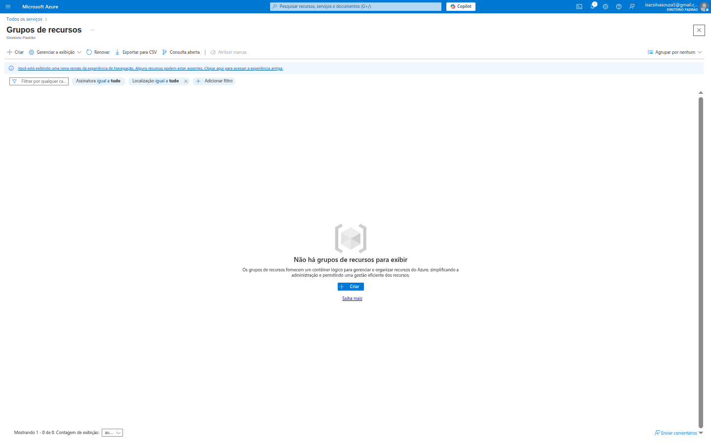
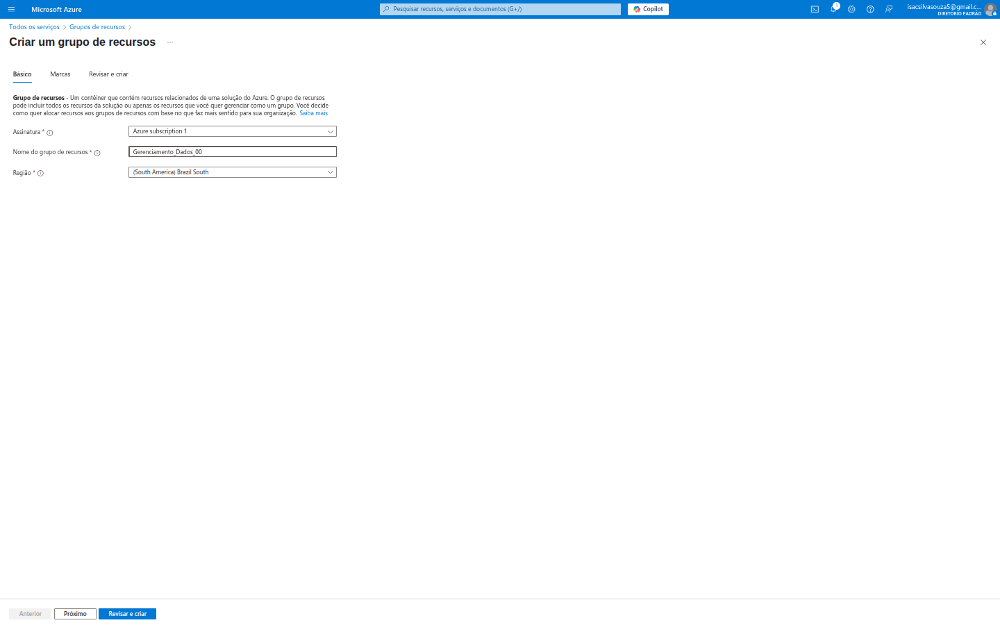
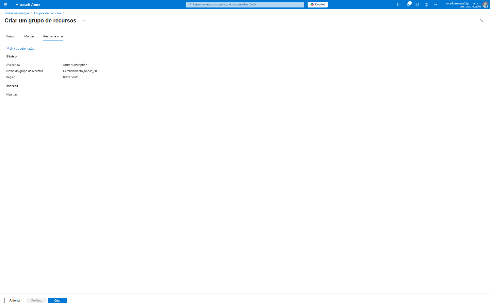

# 🏡 Estruturando sua Nuvem: Entendendo e Criando Grupos de Recursos no Azure

Ao dar os primeiros passos no Microsoft Azure, uma das primeiras coisas que me chamou a atenção foi a necessidade de organização. Com tantos serviços e recursos disponíveis (máquinas virtuais, bancos de dados, aplicações, redes, etc.), como garantir que tudo permaneça arrumado e gerenciável? A resposta está nos **Grupos de Recursos**.

Pense nos Grupos de Recursos como as pastas bem organizadas no seu computador, mas para o seu ambiente de nuvem. Cada "pasta" (Grupo de Recursos) contém todos os "arquivos" (recursos do Azure) relacionados a um projeto, aplicação ou ambiente específico.

Este README vai detalhar minha experiência inicial com os Grupos de Recursos, mostrando por que eles são fundamentais e como criá-los no portal do Azure.

---

## 💡 Por que os Grupos de Recursos são tão importantes?

Antes de mergulharmos no "como", vamos entender o "porquê". Os Grupos de Recursos são a espinha dorsal da organização e governança no Azure. Aqui estão os principais motivos para usá-los:

*   **Organização Lógica:** Permitem agrupar recursos que compartilham o mesmo ciclo de vida ou que pertencem à mesma aplicação. Por exemplo, você pode ter um Grupo de Recursos para seu ambiente de desenvolvimento (`MeuProjeto-Dev-RG`) e outro para o ambiente de produção (`MeuProjeto-Prod-RG`).
*   **Gerenciamento Simplificado:** A grande sacada é que você pode gerenciar todos os recursos dentro de um grupo como uma única entidade. Quer deletar um projeto inteiro? Basta deletar o Grupo de Recursos, e todos os recursos dentro dele (VMs, bancos de dados, storage, etc.) serão excluídos de uma vez.
*   **Governança e Controle de Acesso (RBAC):** Você pode aplicar políticas e gerenciar permissões de acesso (quem pode fazer o quê) no nível do Grupo de Recursos. Isso significa que, ao invés de configurar permissões para cada VM ou banco de dados individualmente, você define uma vez para o grupo e todos os recursos herdam essas permissões.
*   **Visibilidade de Custos:** É muito mais fácil rastrear os custos de um projeto específico se todos os seus recursos estiverem em um único Grupo de Recursos. As ferramentas de gerenciamento de custos do Azure podem mostrar o gasto por Grupo de Recursos.
*   **Implantação Consistente (IaC):** Ao usar ferramentas de Infraestrutura como Código (IaC) como Azure Resource Manager (ARM) templates, Terraform ou Bicep, você implanta soluções inteiras em Grupos de Recursos, garantindo consistência e repetibilidade.

Com esses benefícios em mente, vamos ver como a criação é simples!

---

## 🚶‍♂️ A Jornada de Criação de um Grupo de Recursos

Minha experiência começou na seção "Grupos de recursos" do portal do Azure.

### 1. A Página Inicial dos Grupos de Recursos

Ao acessar a opção `Grupos de recursos` no menu lateral do Azure, fui recebido(a) por uma tela que indicava a ausência de grupos.

A mensagem "Não há grupos de recursos para exibir" e a explicação de que "Os grupos de recursos formam um contêiner lógico para gerenciar e organizar recursos do Azure, simplificando a administração para seus dados, entre outras coisas" deixam bem claro o propósito. O botão **"Criar"** é o convite para começar.

Notei também os filtros no topo (`Assinatura`, `Localização`), que seriam úteis quando eu tivesse muitos grupos para encontrar um específico.

### 2. Iniciando a Criação: A Aba "Básico"

Ao clicar em "Criar", fui direcionado(a) para um painel de criação simples e direto, começando pela aba **"Básico"**.

Aqui, as informações essenciais a serem fornecidas são:

*   **Assinatura:** Escolhi a `Azure subscription 1`. É fundamental, pois define qual conta será faturada pelos recursos que eu criar dentro deste grupo.
*   **Nome do grupo de recursos:** Dei um nome claro e descritivo para o meu grupo, neste caso, `Gerenciamento_Dados_00`. É uma boa prática usar nomes que identifiquem o projeto, ambiente ou equipe.
*   **Região:** Escolhi `South America Brazil South`. Embora o grupo de recursos em si seja um conceito lógico e não "resida" fisicamente em uma região, a metadata sobre ele é armazenada ali. Além disso, é uma boa prática escolher uma região que faça sentido para os recursos que você criará dentro dele, visando menor latência e conformidade.

Há também uma aba "Marcas" (ou Tags) que não foi preenchida neste exemplo, mas é importante mencionar que as tags são pares de nome/valor para categorizar recursos ainda mais (ex: `Ambiente: Desenvolvimento`, `CustoCentro: Marketing`).

### 3. Revisar e Criar: O Resumo

Após preencher as informações básicas, cliquei em "Revisar + criar" (ou "Próximo" para a aba de marcas). Cheguei à aba **"Revisar + criar"**, que oferece um resumo das minhas escolhas.

Nesta tela, pude confirmar o `Assinatura`, o `Nome do grupo de recursos` e a `Região` que selecionei. Se eu tivesse adicionado tags, elas também apareceriam aqui.

Um detalhe muito interessante que notei foi o link **"Código de automação"**. Clicar nele me permitiria ver o template JSON do Azure Resource Manager (ARM) para criar este grupo de recursos. Isso é perfeito para automação e para quem quer aprender Infraestrutura como Código!

Com tudo revisado, o botão `Criar` se torna ativo, e ao clicar nele, o Grupo de Recursos é provisionado em questão de segundos.

### 4. O Grupo de Recursos Criado: Visão Geral

Após a criação, o portal me levou para a página de **Visão geral** do novo Grupo de Recursos.

Aqui, pude ver as informações básicas (`Assinatura`, `Local`, `ID de Assinatura`). No centro da tela, a mensagem "Nenhum recurso corresponde aos seus filtros" é esperada, pois o grupo acabou de ser criado e ainda não contém nenhum recurso. Há um botão `Criar recurso` que é o próximo passo lógico para começar a popular este grupo com VMs, bancos de dados, etc.

Mas o que realmente me impressionou foi o menu de navegação à esquerda. Ele revela o verdadeiro poder dos Grupos de Recursos como centro de gerenciamento:

*   **Log de atividade:** Mostra quem fez o quê, quando e onde neste grupo. Essencial para auditoria.
*   **Controle de acesso (IAM):** Permite gerenciar quem tem permissão para acessar e modificar os recursos neste grupo.
*   **Marcadores:** Para adicionar ou editar tags que ajudam na organização e no gerenciamento de custos.
*   **Eventos:** Informações sobre eventos que ocorrem no grupo.
*   **Políticas:** Para aplicar regras e padrões (ex: "apenas máquinas virtuais de um determinado tamanho podem ser criadas neste grupo").
*   **Bloqueios:** Para evitar exclusão acidental ou modificação de recursos importantes.
*   **Gerenciamento de Custos:** Um link direto para monitorar os gastos dos recursos dentro deste grupo.
*   **Automação:** Opções para automatizar tarefas relacionadas a este grupo.

---

## ✅ Conclusão: A Base para uma Nuvem Organizada

Minha primeira experiência com os Grupos de Recursos no Azure me mostrou que eles são mais do que apenas "pastas". Eles são a pedra fundamental para uma gestão eficaz, segura e econômica da sua infraestrutura na nuvem.

Para qualquer um começando no Azure, entender e utilizar Grupos de Recursos de forma inteligente desde o início fará toda a diferença na organização, no controle de custos e na facilidade de gerenciamento de seus projetos à medida que eles crescem.

Estou animado(a) para usar este conhecimento para manter meus futuros projetos Azure impecavelmente organizados! Fiquem ligados para mais aprendizados sobre o Azure neste repositório!
