# 🤖 Aplicações Inteligentes com o Azure AI Language Service

Em nossa jornada exploratória pelo Microsoft Azure, chegamos a um dos serviços mais fascinantes e com maior potencial para o futuro da tecnologia: a **Inteligência Artificial (IA)**. Especificamente, mergulharemos no **Azure AI Language service**, uma ferramenta poderosa que permite que suas aplicações entendam e processem a linguagem humana de uma forma que antes parecia coisa de ficção científica.

Pense nisso: como seria se seu aplicativo pudesse ler e compreender e-mails de clientes, resumir documentos extensos, responder perguntas complexas ou até mesmo detectar o sentimento em um tweet? Tudo isso é possível com o Azure AI Language.

Este README irá detalhar minha primeira experiência com este serviço, desde a criação do recurso no portal até a exploração de suas capacidades no **Language Studio**. Se você está curioso(a) sobre como dar voz e compreensão linguística às suas aplicações, este é o lugar certo!

---

## 💡 Por que escolher o Azure AI Language Service?

O Azure AI Language é parte da família de **Serviços Cognitivos** do Azure, que são APIs e serviços de IA pré-construídos que permitem adicionar inteligência a suas aplicações sem a necessidade de ser um cientista de dados. Aqui estão alguns motivos para considerar este serviço:

*   **Modelos Pré-treinados:** Ele vem com uma vasta gama de modelos de Processamento de Linguagem Natural (PLN) já treinados, prontos para uso imediato. Isso significa que você não precisa de grandes conjuntos de dados ou conhecimento profundo em Machine Learning para começar.
*   **Capacidades Personalizadas:** Embora existam modelos pré-treinados, o serviço também permite que você treine seus próprios modelos de PLN com seus dados específicos, garantindo precisão para seus casos de uso únicos.
*   **Escalabilidade e Confiabilidade:** Como um serviço Azure, ele escala automaticamente para atender às suas demandas, desde alguns pedidos até milhões de transações diárias, com a confiabilidade da infraestrutura global da Microsoft.
*   **Integração Simples:** O acesso se dá via APIs REST ou SDKs para diversas linguagens de programação, facilitando a integração em qualquer aplicação.
*   **IA Responsável:** A Microsoft enfatiza a IA Responsável, fornecendo diretrizes e ferramentas para garantir que as soluções de IA sejam desenvolvidas e usadas de forma ética.

Com esses benefícios em mente, vamos ver como configurá-lo!

---

## 🚶‍♂️ A Jornada de Criação do Azure AI Language Service

Minha experiência começou explorando a opção "Language service" dentro de "AI Foundry" no portal do Azure.

### 1. A Página Inicial do Language Service

Ao navegar para `AI Foundry` e depois `Language service`, fui apresentado(a) a uma tela que indicava a ausência de recursos existentes.

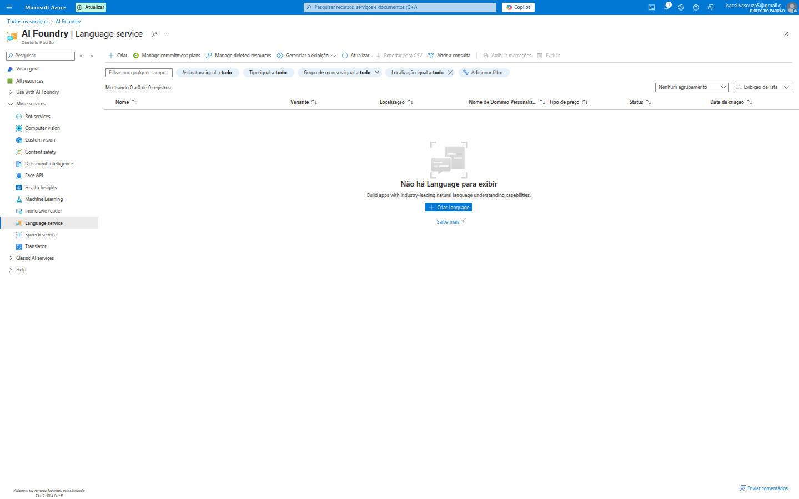

A mensagem "Não há Language para exibir" é clara, e a descrição "Build apps with industry-leading natural language understanding capabilities" (Crie aplicativos com recursos de compreensão de linguagem natural líderes do setor) me convidou a clicar em **"Criar language"**.

### 2. Selecionando Recursos Adicionais: O Poder das Funcionalidades

Após clicar em "Criar", a primeira etapa é selecionar quais funcionalidades adicionais do Language Service eu gostaria de incluir.

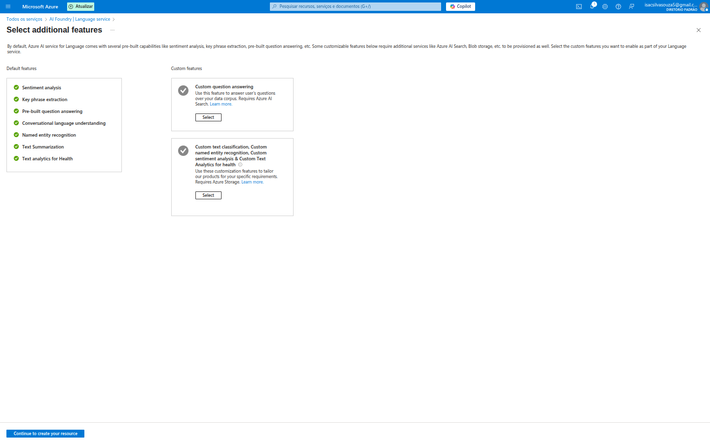

Fiquei impressionado(a) com a gama de opções, divididas entre **"Default features" (Recursos padrão)**, que são sempre incluídos, e **"Custom features" (Recursos personalizados)**, que podem exigir serviços adicionais como Azure AI Search ou Blob Storage.

**Recursos Padrão (Default features):**
*   **Análise de Sentimento:** Detecta o sentimento (positivo, negativo, neutro ou misto) em um texto. *Exemplo: Analisar feedbacks de clientes para entender a satisfação.*
*   **Extração de Frase-chave:** Identifica os principais tópicos ou conceitos em um texto. *Exemplo: Resumir automaticamente o conteúdo de um e-mail longo.*
*   **Reconhecimento de Entidade Pré-criado:** Identifica entidades comuns como pessoas, locais, organizações, datas, e-mails, URLs, etc. *Exemplo: Extrair todos os nomes de cidades de um documento de viagem.*
*   **Compreensão de Linguagem Conversacional:** Entende a intenção e as entidades em conversas e linguagem natural. *Exemplo: Construir um chatbot que entenda o que o usuário quer dizer ("Reservar um voo para Londres") e não apenas palavras-chave.*
*   **Resumo de Texto:** Gera um resumo conciso de um documento ou artigo. *Exemplo: Criar um resumo de notícias diárias a partir de várias fontes.*
*   **Análise de Texto para Saúde:** Extrai informações médicas e de saúde de textos não estruturados. *Exemplo: Processar relatórios médicos para identificar doenças, sintomas e tratamentos.*

**Recursos Personalizados (Custom features):**
*   **Resposta a perguntas personalizadas:** Constrói um serviço de Q&A a partir de um conjunto de perguntas e respostas fornecidas. *Exemplo: Criar uma base de conhecimento para um chatbot de suporte ao cliente.*
*   **Classificação de texto personalizado, Reconhecimento de entidade nomeada personalizado, Análise de sentimento personalizado:** Permite treinar modelos de PLN com seus próprios dados para classificação e extração de entidades específicas do seu domínio. *Exemplo: Classificar chamados de suporte em categorias específicas da sua empresa (Ex: "Problema de Login", "Solicitação de Recurso").*

Para prosseguir, o sistema solicita que eu "Continue para criar seu recurso".

### 3. Configurando o Recurso de Idioma: A Aba "Noções básicas"

A aba **"Noções básicas"** é onde definimos os detalhes fundamentais do nosso recurso.

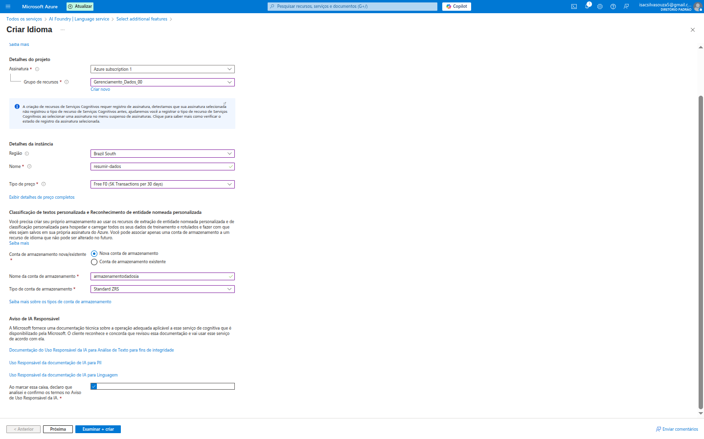

*   **Detalhes do projeto:**
    *   **Assinatura:** `Azure subscription 1`.
    *   **Grupo de recursos:** Selecionei o grupo `Gerenciamento_Dados_00`. Isso garante que meu recurso de linguagem esteja organizado com outros recursos relacionados ao mesmo projeto.
*   **Detalhes da instância:**
    *   **Região:** `Brazil South`. A escolha da região é importante para latência e conformidade de dados.
    *   **Nome:** Dei um nome único ao recurso, como `resumo-dados`.
    *   **Tipo de preço:** `Free F0 (5K Transactions per 30 days)`. Uma ótima opção para experimentar o serviço gratuitamente! O Azure sempre oferece tiers grátis para muitos serviços, permitindo que os desenvolvedores testem e aprendam sem custo.
*   **Classificação de texto personalizado e Reconhecimento de entidade nomeada personalizada:**
    *   Esses recursos personalizados requerem uma **conta de armazenamento** para guardar os dados de treinamento e os modelos. Escolhi `Nova conta de armazenamento` e dei um nome (`armazenamentodadosia`) com tipo `Standard ZRS`.
*   **Área de IA Responsável:** Um lembrete importante sobre o uso ético da IA. Exige que o usuário revise e concorde com os termos de uso responsável da IA.

### 4. Configurações de Rede: A Aba "Rede"

A aba **"Rede"** permite configurar como o serviço de linguagem será acessível.

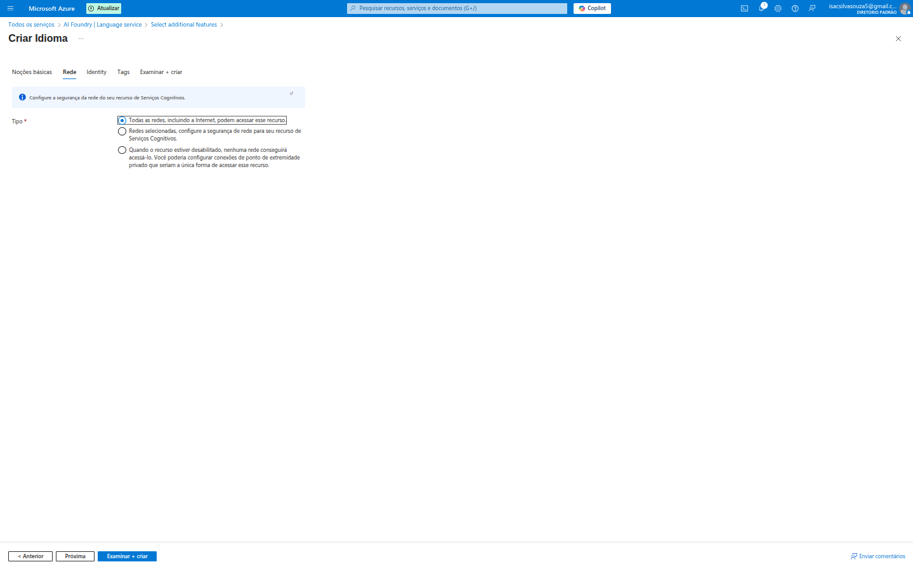

As opções são:
*   **Todas as redes, incluindo a Internet, podem acessar este recurso:** Acesso público, mais fácil para testes e desenvolvimento inicial, mas menos seguro para produção.
*   **Redes selecionadas, configure a segurança da rede para seu recurso de Serviços Cognitivos:** Permite restringir o acesso a IPs específicos ou VNets, ideal para ambientes de produção.
*   **Quando o recurso estiver desabilitado, nenhuma rede conseguirá acessá-lo:** Desabilita todo o acesso.

Para a maioria dos cenários de teste, a opção padrão é suficiente, mas em produção, a restrição de rede é fundamental.

### 5. Gerenciando Identidades: A Aba "Identity"

A aba **"Identity"** trata das identidades gerenciadas, um recurso de segurança do Azure.

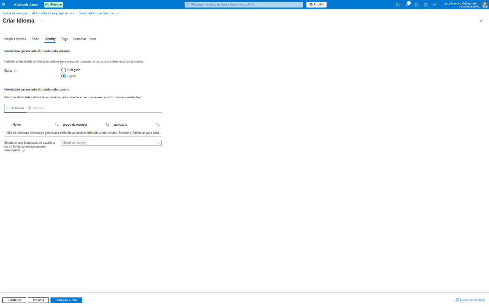

*   **Identidade gerenciada atribuída pelo sistema:** Uma identidade criada e gerenciada automaticamente pelo Azure para o recurso, permitindo que ele se autentique em outros serviços Azure (como o armazenamento de dados) sem a necessidade de credenciais no código. **Recomendado e ativado por padrão.**
*   **Identidade gerenciada atribuída pelo usuário:** Permite atribuir uma identidade gerenciada pré-existente e controlada pelo usuário.

### 6. Revisar e Criar: O Resumo Final

A aba **"Examinar + criar"** é o último passo, onde todas as configurações são resumidas antes da implantação.

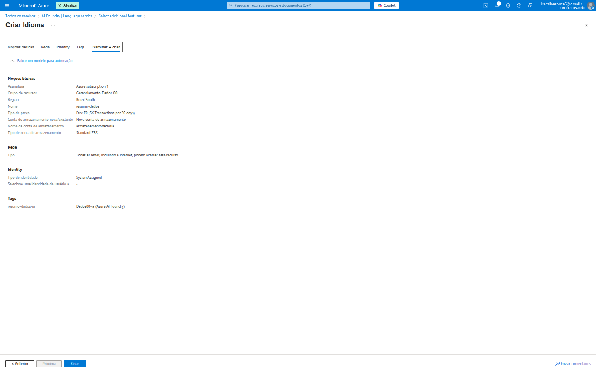

Aqui, pude revisar todos os detalhes: `Noções Básicas`, `Rede`, `Identity` e `Tags`. É crucial verificar se tudo está conforme o esperado, especialmente o tipo de preço, para evitar surpresas no custo. O botão **"Baixar um modelo para automação"** é um recurso valioso para quem quer automatizar a criação de recursos via Infraestrutura como Código (ARM templates).

Com tudo revisado, cliquei em **"Criar"**.

### 7. Implantação Concluída!

Após alguns instantes, a implantação foi concluída com sucesso!

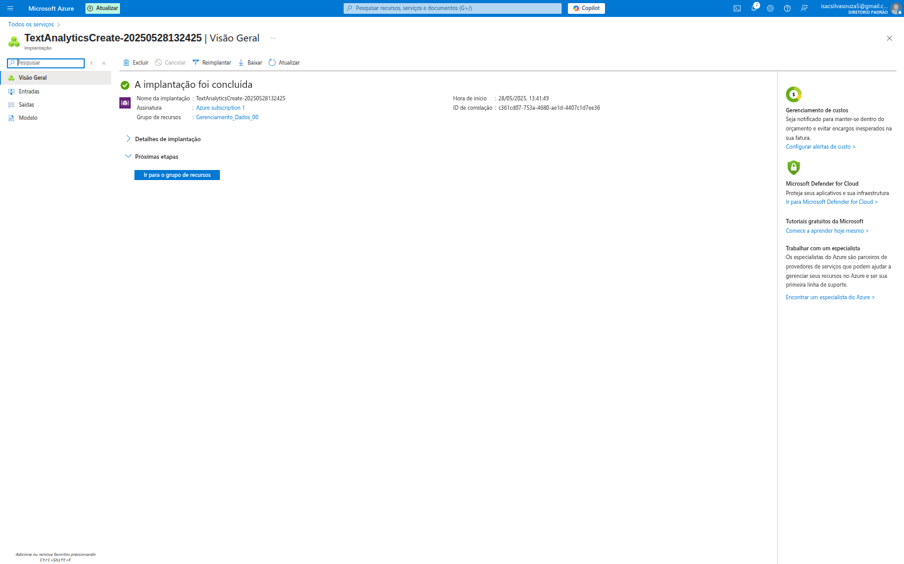

Esta tela de sucesso me informa o nome da implantação, a assinatura e o grupo de recursos. O link **"Ir para o grupo de recursos"** é uma maneira rápida de ver o recurso recém-criado em seu contexto.

---

## 🔭 Explorando o Language Studio: O Playground da IA Linguística

Com o recurso de linguagem criado, o próximo passo é ir para o **Azure AI Language Studio**! Este é o ambiente interativo onde você pode experimentar, testar e construir suas soluções de PLN.

### 8. Bem-vindo ao Language Studio

A primeira vez que acessei o Language Studio, fui recebido(a) por uma tela de boas-vindas com um tour interativo.

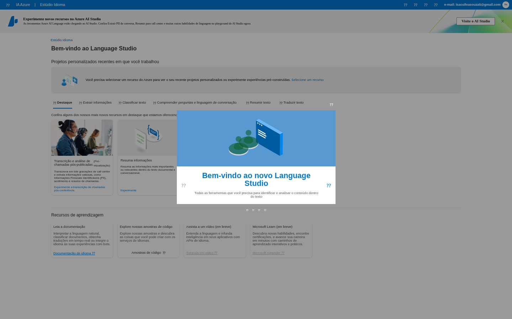

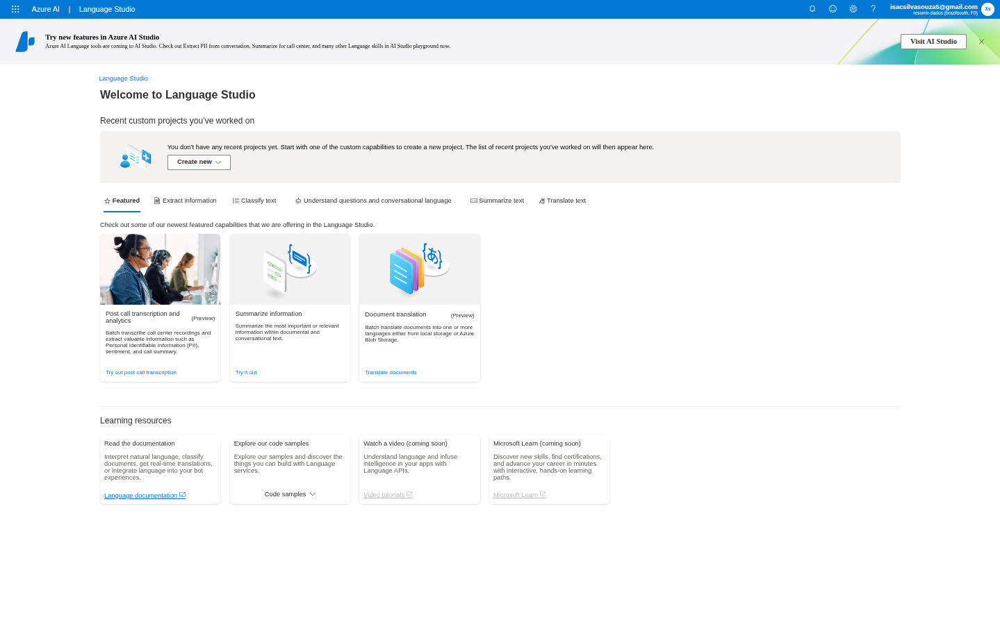

O Studio é dividido em guias como `Featured` (Recursos em destaque), `Extract information` (Extrair informações), `Classify text` (Classificar texto), `Understand questions and conversational language` (Compreender perguntas e linguagem conversacional), `Summarize text` (Resumir texto) e `Translate text` (Traduzir texto).

Ele destaca recursos como:
*   **Transcrição e análise de chamadas pós-venda (Preview):** Para processar gravações de chamadas de call center.
*   **Resumir informações:** Para condensar documentos.
*   **Tradução de documentos (Preview):** Para traduzir textos e documentos.

### 9. Criando um Projeto Personalizado (Exemplo: Compreensão de Linguagem Conversacional)

O Language Studio não é apenas para demonstração de modelos pré-treinados; ele é também o local para construir seus próprios modelos personalizados. Por exemplo, ao clicar em "Criar novo" na seção de "Projetos personalizados recentes", eu poderia iniciar um projeto de **Compreensão de Linguagem Conversacional**.

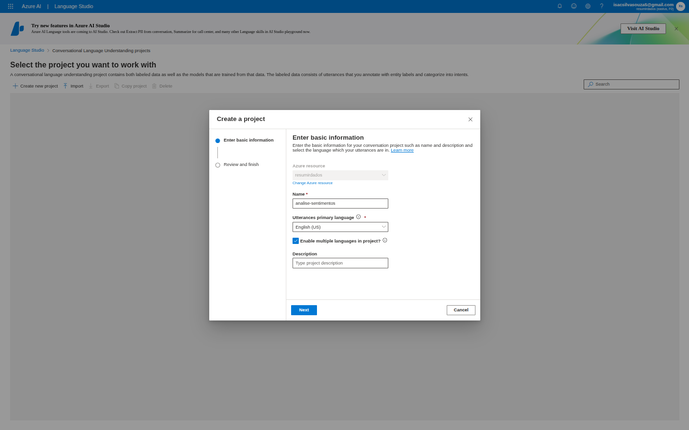

Aqui, definiria o `Nome` do projeto (ex: `analise-sentimentos`), a `Linguagem primária das declarações` (ex: `English (US)`) e, opcionalmente, uma descrição e se suportaria múltiplas linguagens. Este é o ponto de partida para treinar um modelo de chatbot que entenda a intenção do usuário e extraia informações relevantes.

### 10. Experimentando a Análise de Sentimento: Um Exemplo Prático

Uma das funcionalidades mais acessíveis para começar é a **Análise de Sentimento**. Na guia `Classify text`, pude ver as opções:

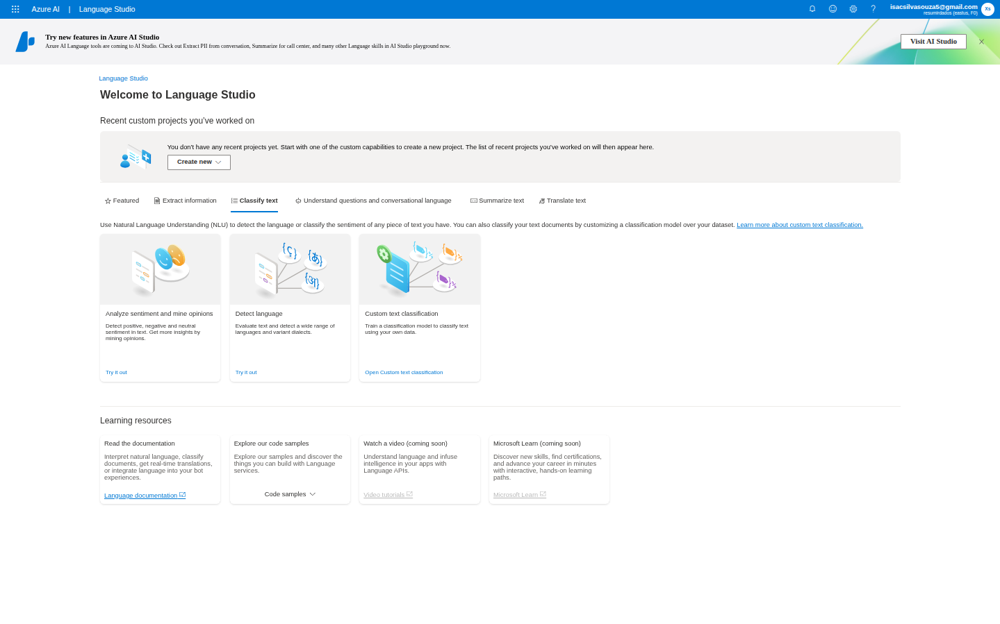

Ao selecionar "Analyze sentiment and mine opinions" (Analisar sentimento e minerar opiniões), fui levado(a) a uma interface de teste.

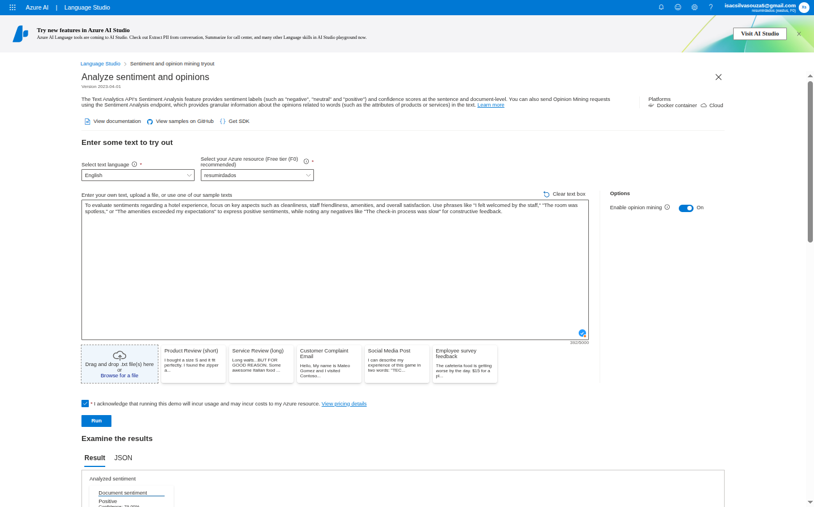

Nesta tela, pude:
*   `Select text language`: Escolher o idioma do texto (Ex: English).
*   `Select your Azure resource`: Escolher o recurso de Language que acabei de criar (`resumo-dados`).
*   `Enter your own text`: Digitar ou colar um texto para análise.
    *   *Exemplo de texto:* "To evaluate sentiments regarding a hotel experience, focus on key aspects such as cleanliness, staff friendliness, amenities, and overall satisfaction. Use phrases like 'I felt welcomed by the staff.' 'The room was spotless.' or 'The amenities exceeded my expectations' to express positive sentiments, while noting any negatives like 'The check-in process was slow' for constructive feedback."
*   `Run`: Executar a análise.

### 11. O Resultado da Análise de Sentimento

O resultado da análise é apresentado em formato JSON, mostrando o sentimento geral do documento e também o sentimento para cada frase.

Para o texto de exemplo, o resultado mostrou:
*   **Sentimento do documento:** `Positive` (Positivo) com uma alta confiança (`79.91%`). Também mostra a porcentagem de sentimento `Neutral` e `Negative`.
*   **Sentimento por frase:** Detalha o sentimento para cada frase individualmente, permitindo uma análise mais granular. Por exemplo, uma frase pode ser positiva enquanto outra na mesma avaliação é negativa ("A comida estava excelente, mas o serviço foi terrível").

**Exemplo de uso:** Uma empresa pode usar essa funcionalidade para processar automaticamente milhões de avaliações de produtos, identificar rapidamente clientes insatisfeitos e encaminhar os casos negativos para ação imediata, melhorando a satisfação do cliente em larga escala.

---

## ✅ Conclusão: O Poder da Linguagem Humana nas suas Mãos!

Minha primeira incursão no Azure AI Language service foi reveladora. É incrível como o Azure democratiza o acesso a capacidades de IA avançadas, permitindo que desenvolvedores incorporem a compreensão da linguagem humana em suas aplicações com facilidade e sem a necessidade de expertise em Machine Learning.

Desde a criação do recurso com opções de preço flexíveis (incluindo um tier grátis) até o playground interativo do Language Studio, a experiência é intuitiva e encorajadora. As diversas funcionalidades pré-treinadas e a capacidade de personalização abrem um leque enorme de possibilidades para inovação.

Se você busca adicionar inteligência e capacidade de comunicação às suas aplicações, o Azure AI Language é, sem dúvida, um serviço a ser explorado. 