# ☁️ Criando Máquinas Virtuais (VMs)

Após ter uma visão geral do portal do Azure, o próximo passo lógico para muitos é criar recursos. As Máquinas Virtuais são incrivelmente versáteis, permitindo que você execute qualquer software que rodaria em um hardware local, mas com a flexibilidade, escalabilidade e gerenciamento da nuvem. Seja para hospedar um servidor web, um banco de dados, um ambiente de desenvolvimento ou um aplicativo específico, as VMs são a base para muitas soluções.

Vamos explorar o processo de criação de uma VM no Azure, passo a passo, como um usuário que está fazendo isso pela primeira vez.

### Máquinas Virtuais: Visão Geral

Ao navegar para "Serviços do Azure" > "Máquinas virtuais" (ou pesquisando por "Máquinas virtuais"), somos recebidos(as) por esta tela.

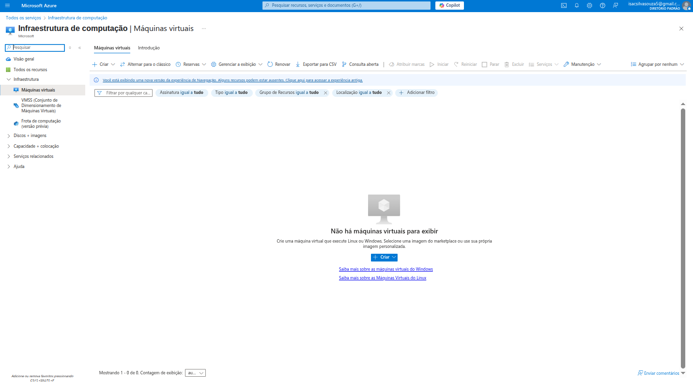

Nesta primeira visualização, a tela mostra que **"Não há máquinas virtuais para exibir"**, o que é esperado, pois estamos começando. O portal nos convida a criar uma nova VM, e já oferece links úteis para saber mais sobre VMs Windows e Linux.

Ao clicar em `Criar`, somos apresentados(as) a algumas opções para iniciar o processo de criação da VM.

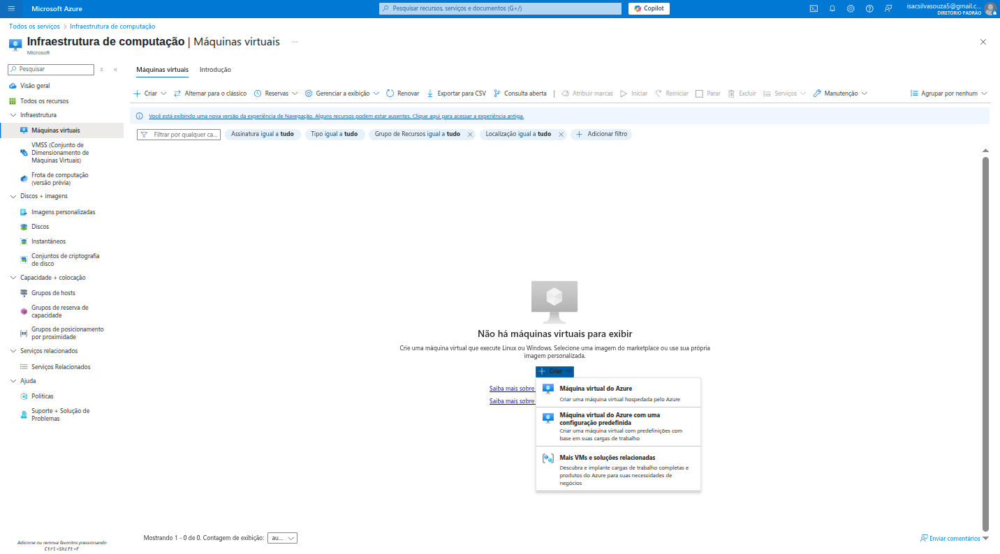

Aqui, as opções principais são:
*   **Máquina virtual do Azure:** Cria uma VM hospedada pelo Azure, com configurações padrão. É a opção mais comum para iniciar.
*   **Máquina virtual do Azure com uma configuração predefinida:** Permite criar uma VM com predefinições baseadas em cargas de trabalho específicas, agilizando o processo.
*   **Mais VMs e soluções relacionadas:** Leva ao Marketplace do Azure para explorar uma gama ainda maior de imagens e soluções prontas.

Para nossa exploração, vamos escolher a primeira opção: **Máquina virtual do Azure**.

### Criar uma máquina virtual

Ao selecionar a criação de uma VM, o portal nos leva a um assistente de várias abas, guiando-nos por todas as configurações necessárias. É um processo detalhado, mas muito bem organizado.

#### 1. Básico 

Esta aba é o ponto de partida, onde definimos as configurações essenciais da VM.

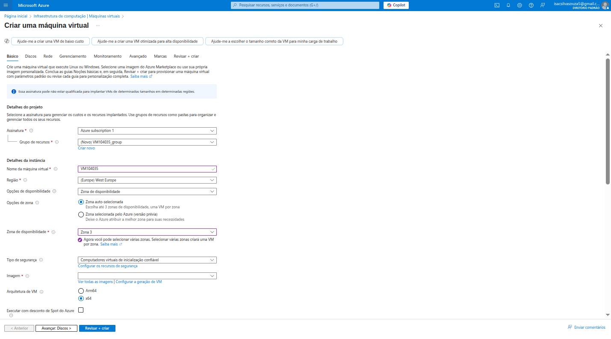

*   **Detalhes do projeto:**
    *   **Assinatura:** `Azure subscription 1`. É a conta de faturamento onde os custos da VM serão associados. No meu caso é uma assinatura de avaliação gratuita.
    *   **Grupo de recursos:** `VM104035_group (novo)`. Grupos de recursos são contêineres lógicos para seus recursos do Azure. Eles são ótimos para organizar, gerenciar e controlar o ciclo de vida de um conjunto de recursos que pertencem a um único projeto ou aplicação. Criar um novo grupo para esta VM garante que eu possa gerenciar (e futuramente excluir) todos os recursos relacionados a ela de forma simples.

*   **Detalhes da instância:**
    *   **Nome da máquina virtual:** `VM104035`. Um nome único para identificar minha VM.
    *   **Região:** `Oeste Europeu`. A localização física onde a VM será implantada. A escolha depende também da disponibilidade de serviços e requisitos de conformidade.
    *   **Opções de disponibilidade:** `Zona de disponibilidade`. As Zonas de Disponibilidade são locais fisicamente separados dentro de uma região do Azure, cada uma com energia, resfriamento e rede independentes. Isso ajuda a proteger suas aplicações e dados contra falhas de datacenter.
    *   **Zona de disponibilidade:** `Zona 3`. Escolhemos uma zona específica para nossa VM dentro da região.
    *   **Tipo de segurança:** `Computadores virtuais de inicialização confiável`. Este é um recurso de segurança que ajuda a proteger contra rootkits, bootkits e malware no nível do kernel, garantindo que a VM inicie com um estado íntegro e verificado.

*   **Imagem:** `Ubuntu Server 24.04 LTS - Gen2`. A imagem é o sistema operacional pré-configurado que será instalado na VM. Ubuntu LTS (Long Term Support) é uma escolha popular para servidores Linux devido ao seu suporte estendido. "Gen2" indica uma imagem de segunda geração, que oferece recursos como inicialização UEFI e melhor desempenho.

*   **Arquitetura da VM:** `x64`. A arquitetura do processador.

*   **Tamanho:** `Standard B1s - 1 vCPU, 1 GB memória`. O tamanho da VM define sua capacidade de CPU, memória, armazenamento e rede. O "B1s" é um tamanho de VM de "estouro" (burstable), o que significa que ele pode rodar em um nível de CPU baixo e "estourar" para um uso maior quando necessário, sendo econômico para cargas de trabalho que não precisam de CPU constante. O "Serviços gratuitos" indica que este tamanho pode se qualificar para a oferta de serviços gratuitos de algumas assinaturas.

*   **Habilitar Hibernação:** Deixado desmarcado. A hibernação permite que a VM salve seu estado na memória para disco e se desligue, reduzindo custos quando não está em uso, mas ainda mantendo o estado para um reinício rápido.

*   **Executar com desconto de Spot do Azure:** Deixado desmarcado. VMs Spot são uma opção econômica para cargas de trabalho flexíveis que podem ser interrompidas. Elas aproveitam a capacidade não utilizada do Azure com um desconto significativo, mas podem ser desalocadas a qualquer momento se o Azure precisar da capacidade.

---

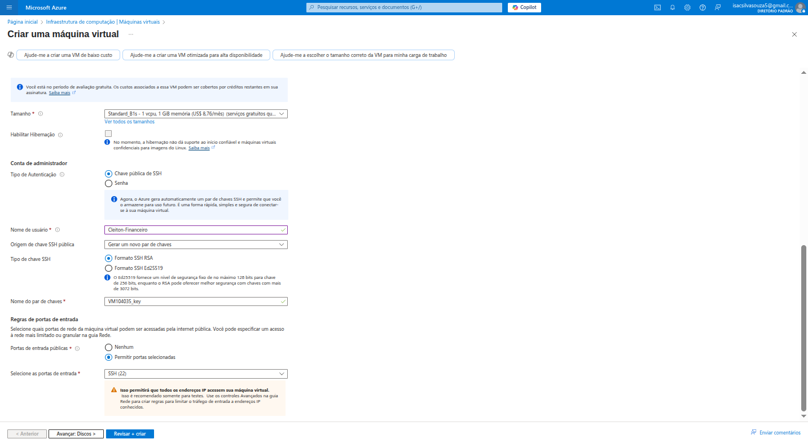

*   **Conta de administrador:**
    *   **Nome de usuário:** `Cleiton-Financeiro`. O nome de usuário para acessar a VM.
    *   **Tipo de autenticação:** `Chave pública SSH`. Para VMs Linux, o método mais seguro e recomendado para acesso é via chaves SSH (Secure Shell). Ele usa um par de chaves (uma pública na VM, uma privada no seu computador) para autenticação, em vez de senhas.
    *   **Origem da chave SSH pública:** `Gerar um novo par de chaves`. Permite que o Azure gere um novo par de chaves para você.
    *   **Nome do par de chaves:** `VM104035_key`. O nome para o arquivo de chave privada para download.

*   **Regras de porta de entrada:**
    *   **Portas de entrada públicas:** `Permitir portas selecionadas`.
    *   **Selecione as portas de entrada:** `SSH (22)`. Esta regra permite o acesso SSH (porta 22) à VM a partir de qualquer endereço IP na internet (`0.0.0.0/0`).
    *   **⚠ IMPORTANTE:** O portal exibe um aviso claro: "Isto permitirá que todos os endereços IP acessem sua máquina virtual. Isso é recomendado somente para testes." Para ambientes de produção, é **altamente recomendado** restringir o acesso apenas a IPs específicos (por exemplo, o IP do seu escritório) ou usar métodos mais seguros como o Azure Bastion, VPNs ou Just-In-Time VM Access para proteger a VM contra ataques.

#### 2. Discos 

Nesta aba, configuramos os discos de armazenamento da VM.

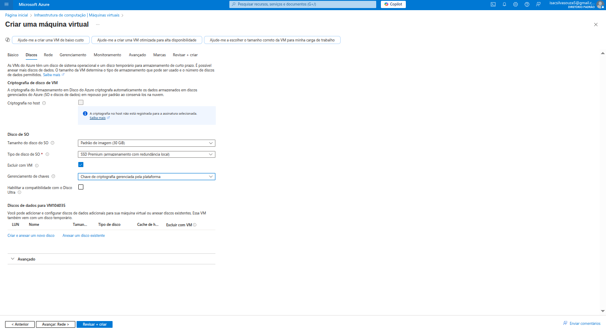

*   **Criptografia de disco de VM:** `Não habilitada`. A criptografia protege os dados em repouso no disco da VM. Para dados sensíveis, habilitar a criptografia (gerenciada pela plataforma ou por chaves do cliente) é uma boa prática de segurança.
*   **Disco de SO:**
    *   **Tamanho do disco de SO:** `Padrão de imagem (30 GB)`. O tamanho padrão do disco onde o sistema operacional será instalado.
    *   **Tipos de disco de SO:** `SSD Premium (armazenamento com redundância local)`.
        *   **SSD Premium:** Discos de estado sólido de alto desempenho, ideais para cargas de trabalho de produção que exigem baixa latência e alta IOPS.
        *   **Armazenamento com redundância local (LRS):** Os dados são replicados três vezes dentro de um único datacenter na região selecionada, oferecendo boa durabilidade, mas sem proteção contra falhas de datacenter.
    *   **Excluir com VM:** Marcado. Isso significa que, ao excluir a VM, o disco do sistema operacional também será excluído automaticamente. Para discos de dados que podem precisar ser preservados, esta opção deve ser desmarcada.
    *   **Gerenciamento de chaves:** `Chave de criptografia gerenciada pela plataforma`. Se a criptografia de disco fosse habilitada, esta opção usaria chaves gerenciadas pelo próprio Azure.

*   **Discos de dados para VM104035:** Permite adicionar discos adicionais para armazenar dados (como arquivos de banco de dados, logs de aplicativos, etc.) separadamente do disco do sistema operacional. Isso é uma boa prática para flexibilidade, desempenho e gerenciamento de backup.

#### 3. Rede 

A aba de rede é crucial para como sua VM se comunicará com a internet e com outros recursos no Azure.

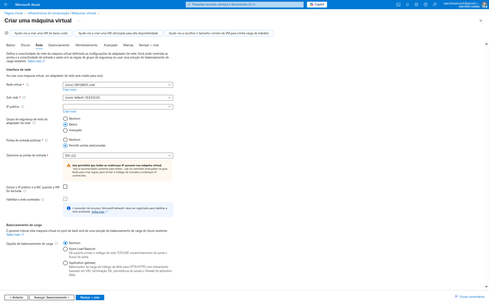

*   **Interface de rede:**
    *   **Rede virtual:** `VM104035-vnet (novo)`. Uma rede virtual é uma rede isolada logicamente dentro do Azure, onde suas VMs e outros recursos podem se comunicar de forma segura e privada. O Azure cria uma nova rede virtual padrão para esta VM.
    *   **Sub-rede:** `default (10.0.0.0/24)`. Uma sub-rede é uma divisão da rede virtual, permitindo organizar e isolar recursos dentro da VNet.
    *   **IP público:** `(novo) VM104035-ip`. Um endereço IP público é necessário para que a VM possa ser acessada da internet. Ele será gerado automaticamente.
    *   **Grupo de segurança de rede do adaptador de rede:** `Básico`. Um Network Security Group (NSG) funciona como um firewall, permitindo ou negando tráfego de rede para a VM. "Básico" cria um NSG com regras padrão.
    *   **Portas de entrada públicas:** `Permitir portas selecionadas` -> `SSH (22)`. **Novamente, o aviso de segurança se repete**, reforçando a importância de não deixar portas abertas para a internet em ambientes de produção.

*   **Excluir o IP público e a NIC quando a VM for excluída:** Deixado desmarcado. Se esta opção for marcada, o IP público e a interface de rede (NIC) associados à VM serão excluídos automaticamente quando a VM for removida.

*   **Habilitar rede acelerada:** Deixado desmarcado. A rede acelerada melhora o desempenho da rede da VM, habilitando a virtualização de E/S de raiz única (SR-IOV) para o adaptador de rede. É recomendada para cargas de trabalho que exigem alta taxa de transferência e baixa latência.

*   **Balanceamento de carga:** `Nenhum`. Esta opção permite configurar a VM para fazer parte de uma solução de balanceamento de carga, como um Azure Load Balancer (para distribuição de tráfego em portas e protocolos) ou um Application Gateway (para balanceamento de carga de HTTP/HTTPS e recursos de firewall de aplicativo web).

#### 4. Gerenciamento 

Esta aba permite configurar opções para gerenciamento, segurança e operação da VM.

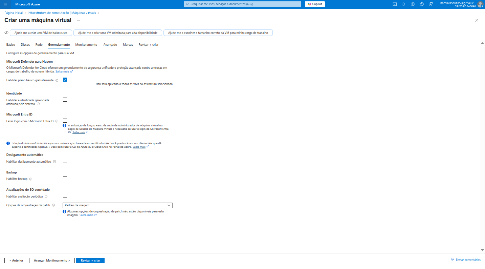

*   **Microsoft Defender para Nuvem:** `Habilitar plano básico gratuitamente`. O Defender para Nuvem oferece proteção aprimorada contra ameaças e gerenciamento de postura de segurança para seus recursos do Azure. Habilitar o plano básico é uma ótima maneira de começar a monitorar a segurança da sua VM.
*   **Identidade gerenciada:** Deixado desmarcado. Identidades gerenciadas permitem que recursos do Azure se autentiquem em outros serviços do Azure (como Azure Key Vault, Azure Storage) de forma segura, sem precisar gerenciar credenciais em seu código.
*   **Desligamento automático:** Deixado desmarcado. Esta é uma funcionalidade útil para economizar custos, permitindo que você configure um horário para a VM ser desligada automaticamente (por exemplo, fora do horário comercial).
*   **Backup:** Deixado desmarcado. O backup do Azure é crucial para a recuperação de desastres, permitindo restaurar a VM para um estado anterior em caso de perda de dados ou falha.
*   **Atualizações do SO convidado:** Deixado desmarcado. Permite configurar o gerenciamento de patches e atualizações de segurança para o sistema operacional dentro da VM.

#### 5. Monitoramento 

Aqui configuramos como a VM será monitorada para garantir seu bom funcionamento.

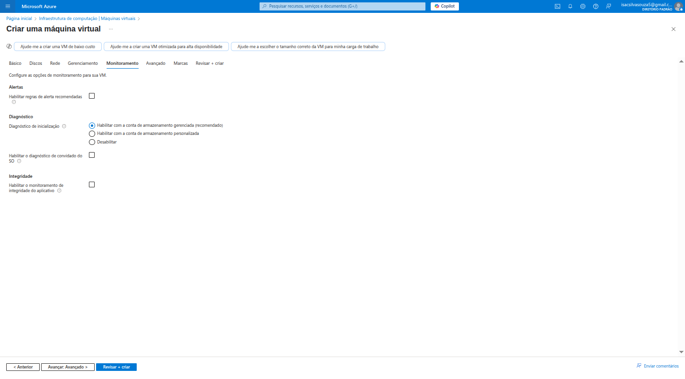

*   **Alertas:** Deixado desmarcado. Alertas podem ser configurados para notificar sobre eventos importantes (por exemplo, CPU alta, pouco espaço em disco) e ajudar a reagir proativamente a problemas.
*   **Diagnóstico:**
    *   **Diagnóstico de inicialização:** `Habilitar com a conta de armazenamento gerenciada recomendado`. O diagnóstico de inicialização captura logs de console serial e capturas de tela da VM durante a inicialização, o que é inestimável para solucionar problemas de inicialização de VMs.
    *   **Diagnóstico de SO convidado:** Deixado desmarcado. Habilita a coleta de métricas de desempenho e logs de eventos do sistema operacional dentro da VM.
*   **Integridade:** Deixado desmarcado. Permite o monitoramento de integridade da aplicação, que pode ser usado para reiniciar VMs que falham em um teste de integridade.

#### 6. Avançado 

Esta aba oferece opções mais avançadas para otimizar o desempenho e a configuração da VM.

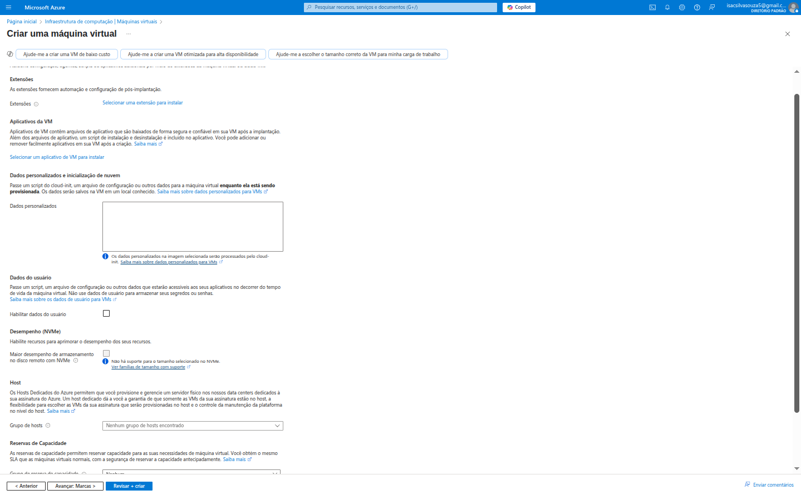

*   **Extensões:** Permite adicionar extensões à VM para automatizar tarefas de pós-implantação, como instalar software, configurar firewalls ou executar scripts personalizados. Há muitas extensões disponíveis para diversas finalidades.
*   **Dados personalizados e inicialização de nuvem:**
    *   **Dados personalizados:** Permite passar um script de shell ou uma configuração cloud-init para a VM durante o provisionamento. Isso é extremamente útil para automatizar a instalação de pacotes, a configuração de serviços ou a execução de qualquer comando de inicialização assim que a VM estiver online.
    *   **Dados de usuário:** Semelhante aos dados personalizados, mas pode ser usado para informações menos sensíveis.
*   **Desempenho NVMe:** Deixado desmarcado. Permite habilitar o desempenho NVMe para tipos de VMs que suportam esse tipo de armazenamento de alta performance.
*   **Host:** Permite especificar um grupo de hosts dedicado, onde as VMs são implantadas em servidores físicos dedicados a uma única assinatura do Azure. Isso é útil para requisitos de conformidade ou para otimizar o licenciamento.
*   **Reservas de Capacidade:** Permite reservar capacidade de computação em uma região do Azure para garantir a disponibilidade de VMs para suas cargas de trabalho críticas.

#### 7. Marcas 

As "Marcas" (Tags) são pares de nome/valor que ajudam a categorizar e organizar recursos do Azure.

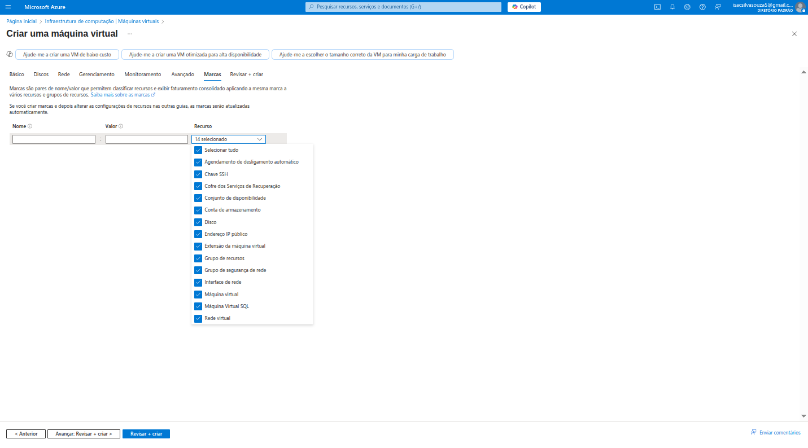

*   **Propósito:**
    *   **Organização:** Marque recursos por ambiente (desenvolvimento, teste, produção), centro de custo, proprietário, departamento, etc.
    *   **Gerenciamento de custos:** Marcas podem ser usadas para filtrar relatórios de custos e alocar gastos a diferentes equipes ou projetos.
    *   **Automação:** Podem ser usadas em scripts e políticas para automatizar tarefas baseadas em categorias de recursos.

Ao criar a VM, várias marcas padrão podem ser aplicadas automaticamente, mas você pode adicionar as suas próprias para melhor governança.

#### 8. Revisar + criar 

Esta é a etapa final antes de iniciar o provisionamento da VM.

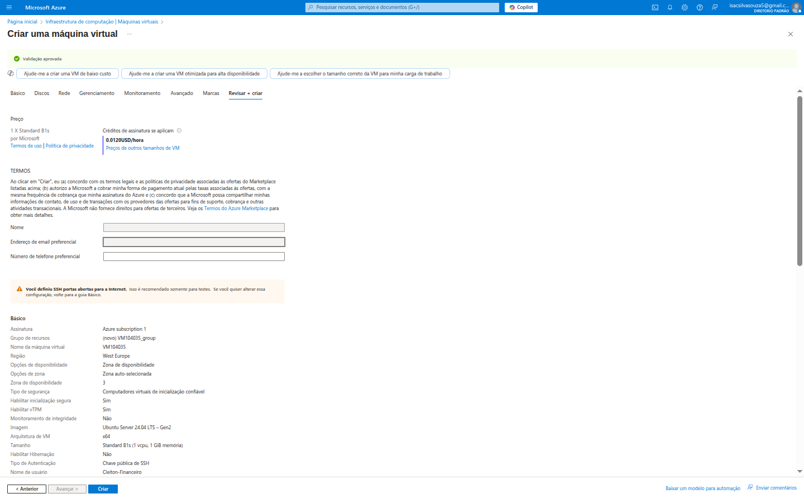

*   **Validação aprovada:** O Azure verifica todas as configurações para garantir que não há erros ou conflitos antes de prosseguir.
*   **Preço:** É apresentada uma estimativa de custo por hora para a VM com as configurações escolhidas (`0.0120/hora`). Isso é fundamental para o gerenciamento de custos na nuvem.
*   **Termos:** É preciso aceitar os termos de serviço e privacidade da Microsoft.
*   **Resumo:** Uma lista detalhada de todas as configurações que foram definidas nas abas anteriores. É uma última chance para revisar tudo cuidadosamente.
*   **⚠ ALERTA FINAL DE SEGURANÇA:** O portal me lembra **pela terceira vez** que a porta SSH (22) está aberta para a internet, reforçando que essa configuração é recomendada apenas para testes e que em um ambiente de produção eu deveria ter um acesso mais restrito. Esta repetição é um ponto muito positivo do Azure, pois destaca a importância da segurança.

Finalmente, ao clicar em `Criar`, o Azure iniciará o processo de provisionamento da máquina virtual. Isso pode levar alguns minutos, enquanto o Azure aloca os recursos, instala o sistema operacional e aplica as configurações definidas.

---

## ✅ Conclusão sobre a Criação de VMs

A experiência de criação de Máquinas Virtuais no Azure é robusta e completa. O assistente de criação, com suas abas detalhadas, garante que todas as opções importantes sejam consideradas, desde a infraestrutura básica até segurança, rede e monitoramento.

Para um novo usuário, o nível de detalhe pode parecer avassalador à primeira vista, mas os guias e as mensagens de aviso (especialmente sobre segurança) são muito úteis. A capacidade de escolher entre uma vasta gama de sistemas operacionais, tamanhos de VM, tipos de disco e configurações de rede dá uma flexibilidade imensa para atender a quase qualquer necessidade de infraestrutura.

Essa jornada inicial na criação de VMs me mostra que o Azure é uma plataforma que oferece controle granular e, ao mesmo tempo, simplifica tarefas complexas através de sua interface intuitiva. É um passo fundamental para construir qualquer tipo de aplicação ou serviço na nuvem!

---