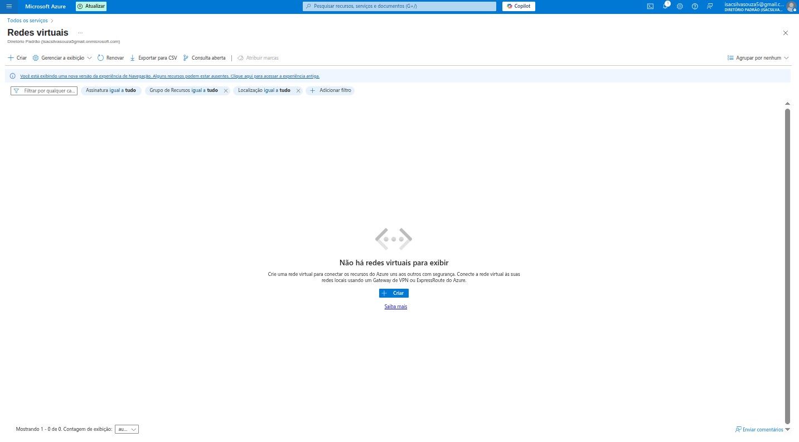
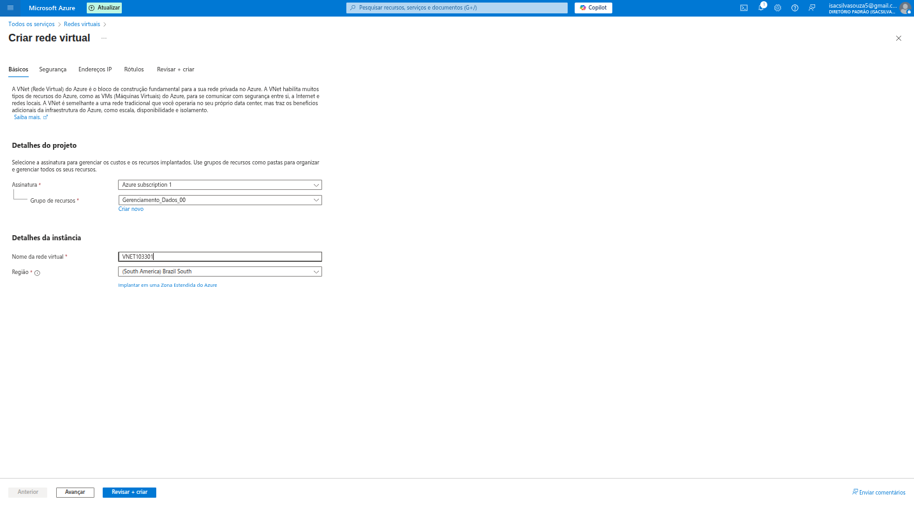
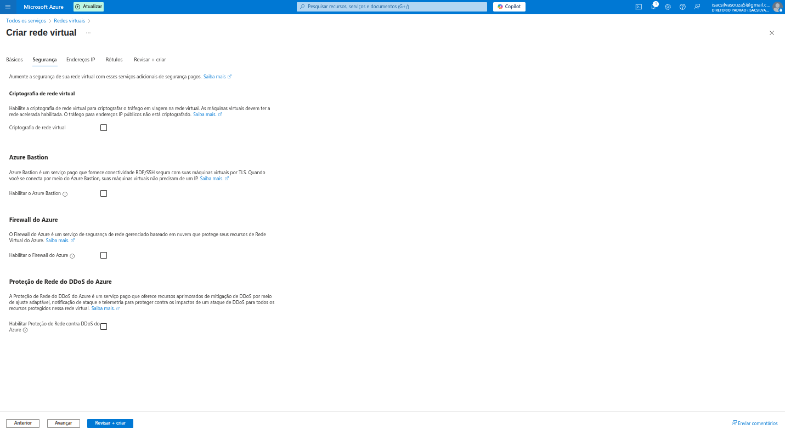
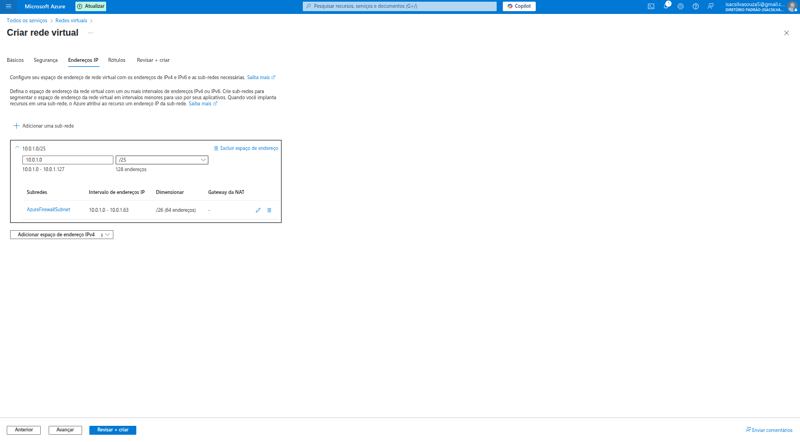
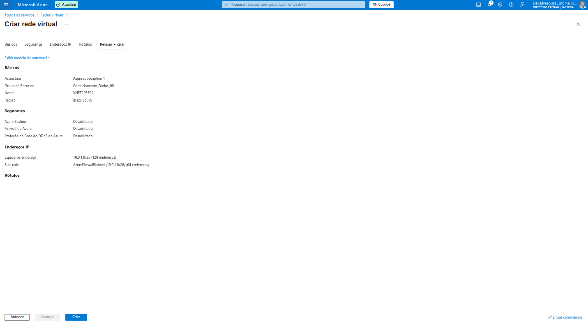

# 🏡 Uma Introdução às Redes Virtuais no Azure

Ao explorar o Microsoft Azure, percebi rapidamente que a base de qualquer infraestrutura robusta na nuvem é a **rede**. Assim como em um data center tradicional, na nuvem precisamos de um espaço de rede privado e seguro para que nossos recursos (máquinas virtuais, bancos de dados, aplicativos) possam se comunicar entre si e com o mundo exterior.

É aí que entram as **Redes Virtuais (VNets)** do Azure! Elas são o equivalente virtual da sua própria rede local, oferecendo isolamento, segurança e a flexibilidade de conectar diferentes partes da sua infraestrutura.

Este README irá guiá-lo(a) através da minha primeira experiência de criação de uma VNet no portal do Azure, explicando cada passo e a importância das configurações.

---

## 💡 Por que as Redes Virtuais são essenciais no Azure?

As Redes Virtuais são muito mais do que apenas um conjunto de IPs. Elas são o alicerce da sua presença na nuvem por vários motivos:

*   **Isolamento e Segurança:** Uma VNet é uma rede privada, isolada de outras redes virtuais. Isso significa que seus recursos estão protegidos por padrão. Você tem controle total sobre o tráfego de entrada e saída.
*   **Conectividade:** Permite que recursos dentro da VNet se comuniquem uns com os outros de forma segura. Além disso, você pode conectar sua VNet à sua rede local (on-premise) via VPN ou ExpressRoute, criando um ambiente de nuvem híbrida.
*   **Segmentação:** Você pode dividir sua VNet em sub-redes (subnets) menores, o que permite agrupar recursos e aplicar regras de segurança específicas para cada segmento. Isso é crucial para a arquitetura de segurança de "defesa em profundidade".
*   **Gerenciamento de IPs:** Você define seu próprio espaço de endereçamento IP privado, evitando conflitos com outras redes e garantindo que seus recursos recebam IPs dentro de uma faixa controlada.
*   **Integração com Serviços Azure:** Muitos serviços do Azure (como Máquinas Virtuais, Bancos de Dados SQL, App Services) podem ser implantados dentro de uma VNet ou conectados a ela, aproveitando a segurança e o isolamento que ela oferece.

Com a importância em mente, vamos ao passo a passo da criação!

---

## 🚶‍♂️ A Jornada de Criação da Rede Virtual no Azure

Minha experiência começou na seção "Redes virtuais" do portal.

### 1. A Página Inicial das Redes Virtuais

A primeira tela que encontrei ao procurar por "Redes virtuais" (ou "Virtual Networks") no portal do Azure foi bem clara, indicando que ainda não havia nenhuma VNet configurada.

A mensagem "Não há redes virtuais para exibir" e a descrição de que "Crie uma rede virtual para conectar os recursos do Azure uns aos outros com segurança..." reforçam a necessidade de um backbone de rede. O grande botão **"Criar"** é o ponto de partida para essa configuração fundamental.

### 2. Definindo o Básico

Ao clicar em "Criar", fui levado(a) a um assistente de criação com várias abas, começando pela aba **"Básicos"**. Esta aba é crucial para definir a identidade e a localização da minha VNet.

Aqui, pude configurar:

*   **Detalhes do projeto:**
    *   **Assinatura:** Escolhi a `Azure subscription 1`, onde os custos serão associados.
    *   **Grupo de recursos:** Selecionei um grupo de recursos já existente (`Gerenciamento_Dados_00`). Reitera a importância de agrupar recursos relacionados para facilitar o gerenciamento e a governança.
*   **Detalhes da instância:**
    *   **Nome da rede virtual:** Dei um nome claro e identificável para minha VNet, como `VNET103301`.
    *   **Região:** Escolhi `South America Brazil South`. A região é fundamental para definir onde os metadados da VNet serão armazenados e, mais importante, onde a maioria dos recursos que usufruirão dessa VNet serão implantados para garantir baixa latência.

### 3. Fortalecendo a Segurança: A Aba "Segurança"

A aba **"Segurança"** é onde pude explorar opções adicionais para proteger minha rede virtual. Embora as opções estivessem desabilitadas por padrão (para simplicidade inicial), é importante entender o que elas oferecem.

Os recursos de segurança adicionais são:

*   **Criptografia de rede virtual:** Habilita a criptografia do tráfego entre máquinas virtuais dentro da VNet. Essencial para cenários de alta segurança.
*   **Azure Bastion:** Um serviço gerenciado que permite conexão segura (RDP/SSH) às suas VMs *sem a necessidade de IPs públicos nas VMs*. Isso melhora drasticamente a segurança, pois expõe menos pontos de entrada à internet. **Altamente recomendado para acesso a VMs.**
*   **Firewall do Azure:** Um serviço de firewall gerenciado que protege sua rede virtual. Permite criar regras de firewall para inspecionar e controlar o tráfego de rede, agindo como um ponto central de segurança.
*   **Proteção de Rede do DDoS do Azure:** Oferece proteção aprimorada contra ataques de Negação de Serviço Distribuída (DDoS) no nível da rede. Crucial para aplicações críticas que precisam de alta disponibilidade.

### 4. Definindo o Espaço de Endereçamento: A Aba "Endereços IP"

A aba **"Endereços IP"** é o coração da configuração da VNet, pois é aqui que eu defino as faixas de IP e as sub-redes.

*   **Espaço de endereço IPv4:** Eu precisei definir a faixa de IP principal para minha VNet. A imagem mostra `10.0.1.0/25`.
    *   **CIDR (Classless Inter-Domain Routing):** O `/25` indica que esta VNet pode ter 128 endereços IP (do 10.0.1.0 ao 10.0.0.127). É uma notação padrão para definir blocos de endereços IP.
    *   **Recomendação:** É uma boa prática usar blocos de IP privados (como 10.0.1.0/8, 172.16.0.0/12 ou 192.168.0.0/16) para suas VNets para evitar conflitos com redes públicas ou outras redes.
*   **Sub-redes:** Dentro do espaço de endereço da VNet, eu posso criar sub-redes para segmentar logicamente minha rede.
    *   A imagem já mostra uma sub-rede chamada `AzureFirewallSubnet` com um intervalo de IP `10.0.1.0/26`. Esta é uma sub-rede especial exigida para o serviço Azure Firewall, se ele for habilitado.
    *   **Por que usar sub-redes?** Elas permitem isolar diferentes tipos de recursos (ex: uma sub-rede para servidores web, outra para servidores de banco de dados), aplicar regras de segurança específicas (via Grupos de Segurança de Rede - NSGs) e gerenciar o tráfego de forma mais granular.
    *   O botão `Adicionar uma sub-rede` permite criar sub-redes adicionais conforme a necessidade da minha arquitetura.

### 5. Rótulos (Tags): Para Organização

Embora não haja uma imagem separada para a aba "Rótulos" neste fluxo específico, ela é uma aba comum na criação de recursos do Azure.

*   Os **Rótulos (Tags)** são pares de nome/valor (ex: `Projeto: MinhaAppWeb`, `Ambiente: Producao`) que ajudam a categorizar e organizar os recursos do Azure.
*   **Importância:** Essencial para gerenciamento de custos (saber quanto cada projeto gasta), automação e governança em ambientes complexos.

### 6. Revisar e Criar: O Resumo Final

Por fim, cheguei à aba **"Revisar + criar"**. Este é o último passo antes de provisionar a VNet.

Nesta tela, o Azure me apresenta um resumo completo de todas as configurações que selecionei nas abas anteriores: `Básicos` (assinatura, grupo de recursos, nome, região), `Segurança` (estado do Bastion, Firewall, DDoS) e `Endereços IP` (espaço de endereço e sub-redes).

Um ponto importante é o link **"Exibir modelo de automação"**. Clicar nele me permitiria ver o template JSON do Azure Resource Manager (ARM) para criar esta VNet. Isso é incrivelmente útil para quem deseja aprender Infraestrutura como Código e automatizar o provisionamento de recursos.

Com tudo revisado e validado (o que é indicado pela ausência de mensagens de erro), o botão `Criar` se torna clicável. Ao clicar nele, a Rede Virtual é provisionada no Azure.

---

## ✅ Conclusão

Minha primeira experiência na criação de uma Rede Virtual no Azure reforçou o quão fundamental e poderosa essa funcionalidade é. É a partir da VNet que toda a sua infraestrutura na nuvem começa a tomar forma, garantindo que seus recursos operem em um ambiente seguro, isolado e gerenciável.

A interface do Azure é muito intuitiva, guiando o usuário passo a passo através das configurações de rede, segurança e IP. Para qualquer desenvolvedor ou arquiteto de nuvem, entender e configurar VNets corretamente é um conhecimento essencial para construir soluções resilientes e seguras no Azure.
