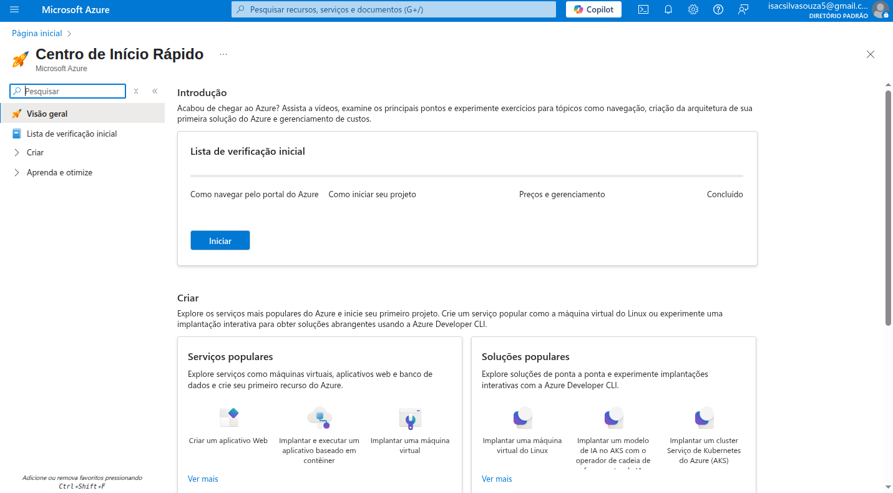
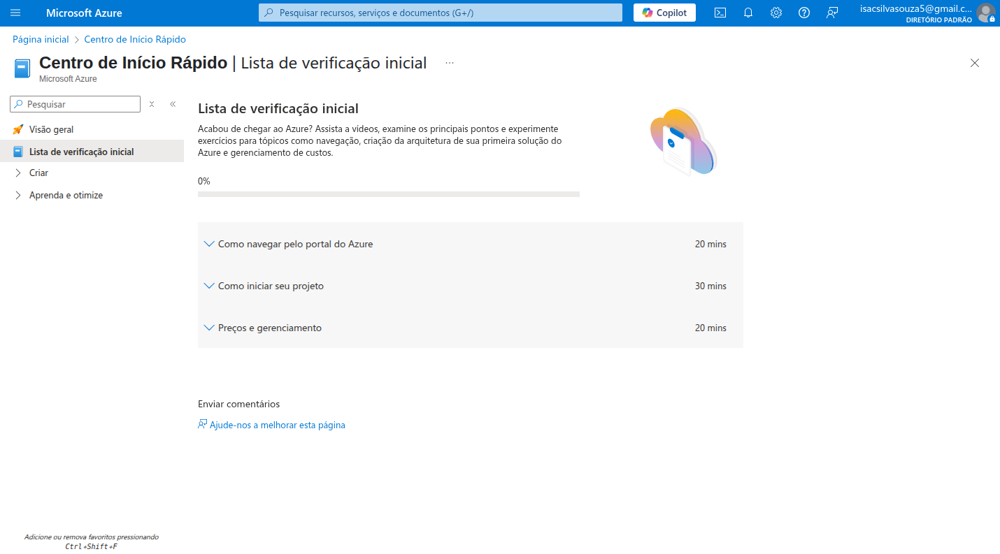
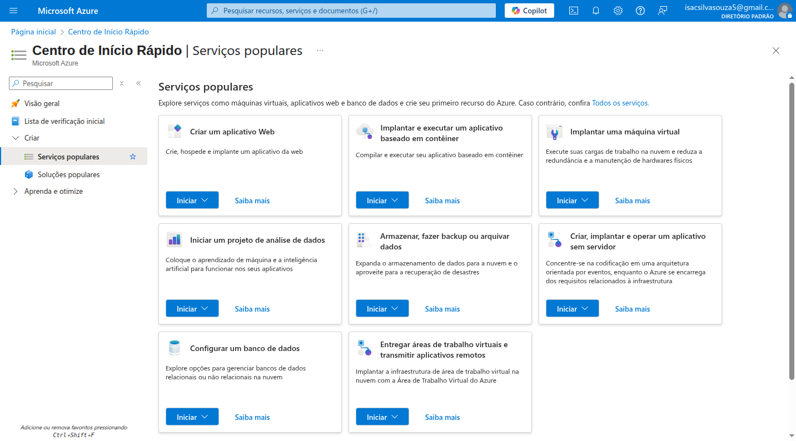
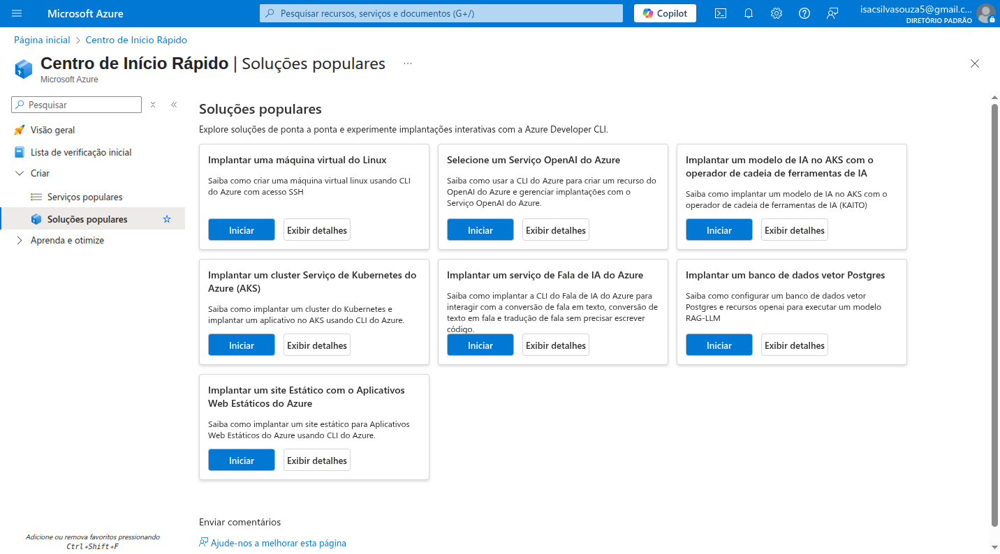
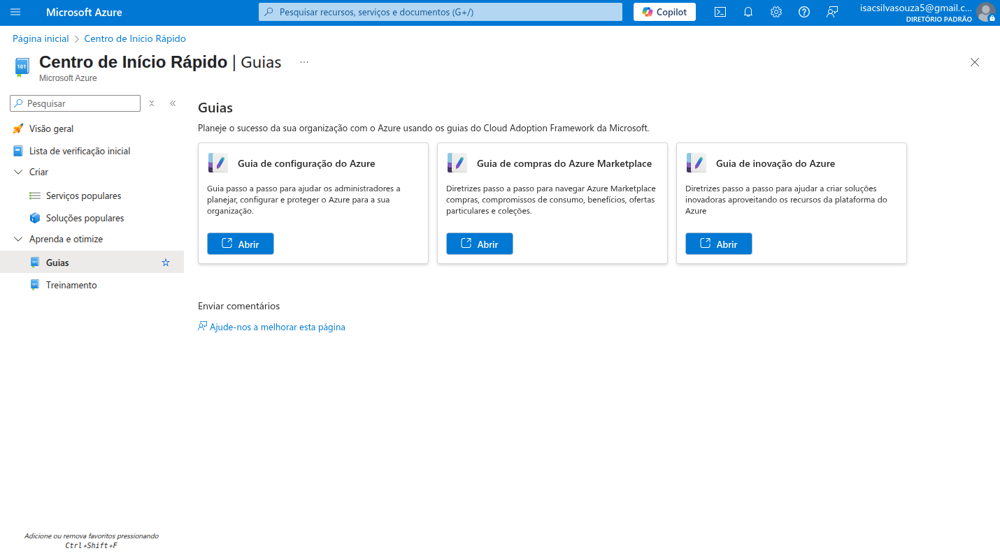
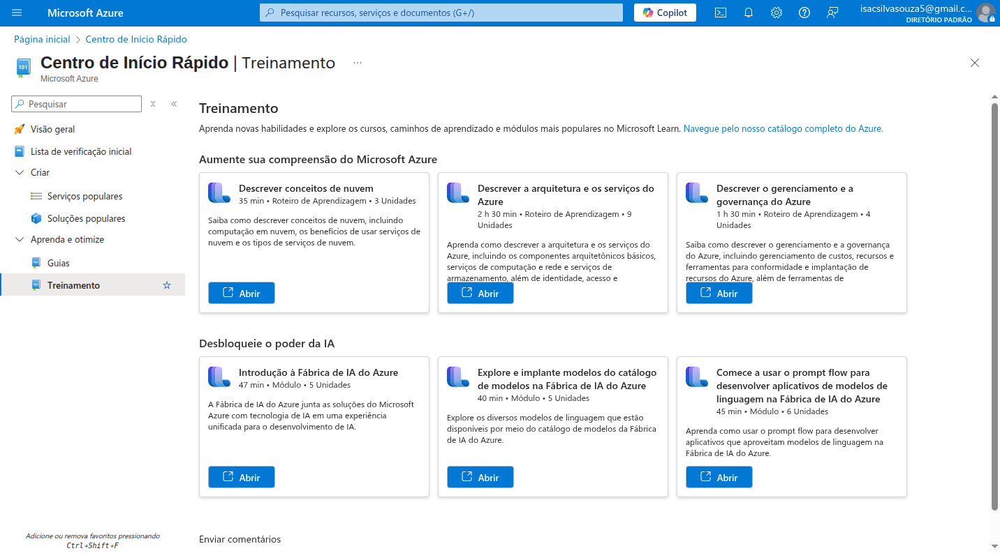
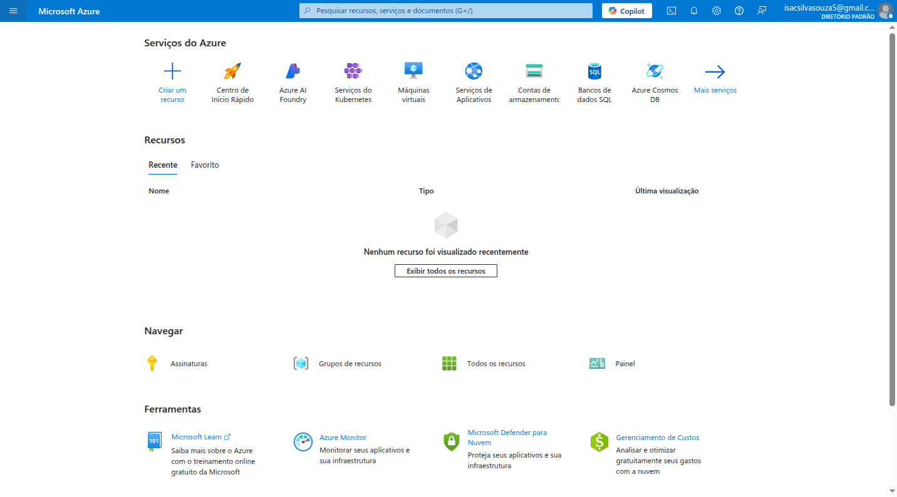
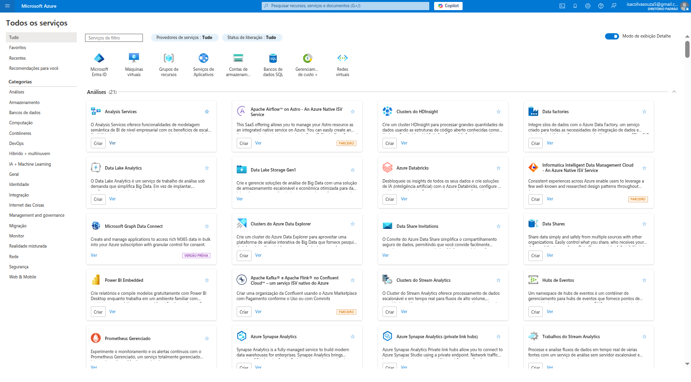

# 🚀 Visita Inicial no Portal da Nuvem Microsoft

Olá, devs! Seja bem-vindo(a) a este pequeno guia sobre os meus primeiros passos e as minhas primeiras impressões ao navegar pelo Microsoft Azure. Como alguém que está entrando no mundo da computação em nuvem, especialmente nos serviços da Microsoft, fiquei bastante impressionado(a) com a robustez e a organização do portal.

Este README tem como objetivo compartilhar essa experiência inicial, detalhando as telas de boas-vindas, os serviços que me foram apresentados e os recursos de aprendizado disponíveis. Se você está pensando em começar sua jornada na nuvem ou simplesmente quer entender um pouco mais sobre o Azure, espero que este conteúdo seja útil!

---

## 💡 Por que o Microsoft Azure? Meus Primeiros Pensamentos

Antes mesmo de mergulhar nos detalhes das telas, a ideia de usar uma plataforma de nuvem como o Azure já me parecia uma escolha estratégica. Aqui estão alguns motivos que me vêm à mente e que o portal prontamente reforça:

*   **Escalabilidade e Flexibilidade:** A capacidade de aumentar ou diminuir recursos conforme a demanda, pagando apenas pelo que usa. Isso é um divisor de águas para qualquer aplicação, desde um pequeno blog até um sistema empresarial complexo.
*   **Ampla Gama de Serviços:** O Azure oferece *muitos* serviços, cobrindo praticamente qualquer necessidade: máquinas virtuais, bancos de dados, inteligência artificial, IoT, desenvolvimento de aplicativos, segurança e muito mais. Não é preciso ir a outro lugar.
*   **Segurança Robusta:** A Microsoft investe pesado em segurança e conformidade, o que é crucial para proteger dados e aplicações.
*   **Integração e Ecossistema:** Como um produto Microsoft, o Azure se integra perfeitamente com outras ferramentas e tecnologias da empresa, o que é uma grande vantagem para quem já usa esse ecossistema.
*   **Inovação Constante:** A nuvem está sempre evoluindo, e o Azure parece estar na vanguarda, especialmente com a integração de serviços de IA de ponta.

Com esses pontos em mente, vamos à exploração!

---

## 🧑‍💻 A Experiência de Boas-Vindas: O Centro de Início Rápido

Ao acessar o portal pela primeira vez, fui direcionado(a) para o **"Centro de Início Rápido"**. É um hub muito intuitivo, projetado para guiar novos usuários. Percebi que ele está dividido em algumas seções principais na navegação lateral esquerda: `Visão geral`, `Lista de verificação inicial`, `Criar` e `Aprenda e otimize`.

### Visão Geral do Centro de Início Rápido

A primeira tela me deu uma introdução amigável e convidativa.

Na `Visão geral`, somos apresentados(as) a um breve texto sobre o que esperar: exemplos e tópicos essenciais como navegação, arquitetura e gerenciamento de custos. Abaixo, são destacadas as primeiras etapas: a "Lista de verificação inicial", "Criar" recursos e "Aprenda e otimize".

### Lista de Verificação Inicial: Os Primeiros Passos Guiados

A seção **"Lista de verificação inicial"** é um excelente ponto de partida. Ela oferece um roteiro claro para quem está começando, com tópicos essenciais e até estimativas de tempo para cada um!

Aqui, pude ver que os tópicos são:
*   **Como navegar pelo portal do Azure:** Essencial para se familiarizar com a interface. (Estimativa: 20 minutos)
*   **Como iniciar seu projeto:** Focado nos primeiros passos práticos. (Estimativa: 30 minutos)
*   **Preços e gerenciamento:** Crucial para entender os custos e otimizar o uso. (Estimativa: 20 minutos)

Essa abordagem passo a passo ajuda muito a não se sentir sobrecarregado(a) pela vastidão da plataforma.

### Criar: Explorando Serviços e Soluções Populares

A seção **"Criar"** é onde a magia acontece! Ela se desdobra em **"Serviços populares"** e **"Soluções populares"**. É aqui que o Azure me mostrou o quão vasta sua oferta de serviços é.

#### Serviços Populares

Esta seção apresenta alguns dos serviços mais utilizados, com botões para `Iniciar` e `Saiba mais`, facilitando a exploração e a criação imediata.

Alguns dos serviços destacados são:

*   **Criar um aplicativo Web:**
    *   **O que é:** Permite hospedar sites e APIs de forma rápida e eficiente, sem se preocupar com a infraestrutura de servidores. É um serviço PaaS (Plataforma como Serviço).
    *   **Por que usar:** Ideal para desenvolvedores que querem focar no código. Suporta diversas linguagens (Node.js, Python, .NET, Java, PHP, etc.).
    *   **Exemplo de uso:** Hospedar um blog, um site de e-commerce, uma API RESTful para um aplicativo móvel.

*   **Implantar e executar um aplicativo baseado em contêiner:**
    *   **O que é:** Oferece maneiras de executar aplicações conteinerizadas (como Docker) de forma gerenciada, desde simples contêineres até orquestração complexa.
    *   **Por que usar:** Consistência entre ambientes (dev, test, prod), portabilidade, escalabilidade e isolamento de dependências.
    *   **Exemplo de uso:** Deploy de microsserviços, aplicações legado empacotadas em contêineres, ambientes de desenvolvimento isolados.

*   **Implantar uma máquina virtual:**
    *   **O que é:** Permite criar máquinas virtuais (VMs) na nuvem, com controle total sobre o sistema operacional (Windows ou Linux) e as configurações de hardware. É um serviço IaaS (Infraestrutura como Serviço).
    *   **Por que usar:** Flexibilidade máxima para instalar software personalizado, rodar sistemas operacionais específicos ou migrar cargas de trabalho on-premise.
    *   **Exemplo de uso:** Servidores de aplicação, bancos de dados legados, ambientes de desenvolvimento e teste, servidores de jogos.

*   **Iniciar um projeto de análise de dados:**
    *   **O que é:** Ferramentas para coletar, processar, armazenar e analisar grandes volumes de dados.
    *   **Por que usar:** Para obter insights, construir modelos de machine learning e tomar decisões baseadas em dados.
    *   **Exemplo de uso:** Análise de dados de vendas, processamento de logs de aplicativos, construção de data lakes para Big Data.

*   **Armazenar, fazer backup ou arquivar dados:**
    *   **O que é:** Soluções de armazenamento seguras e escaláveis para diversos tipos de dados (arquivos, objetos, tabelas, filas) e serviços de backup/recuperação de desastres.
    *   **Por que usar:** Confiabilidade, durabilidade e acesso global aos dados, além de garantir a continuidade dos negócios.
    *   **Exemplo de uso:** Armazenar imagens de um aplicativo, backups de bancos de dados, arquivos de log, dados de arquivo morto para conformidade.

*   **Criar, implantar e operar um aplicativo sem servidor:**
    *   **O que é:** Permite executar código sem provisionar ou gerenciar servidores (serverless), pagando apenas pelo tempo de execução do código.
    *   **Por que usar:** Reduz a complexidade operacional, escala automaticamente e é extremamente econômico para cargas de trabalho intermitentes.
    *   **Exemplo de uso:** Funções de backend para APIs, processamento de eventos (como upload de arquivos), webhooks, automação de tarefas.

*   **Configurar um banco de dados:**
    *   **O que é:** Ofertas gerenciadas de bancos de dados relacionais e não relacionais, como SQL Server, MySQL, PostgreSQL, Cosmos DB (NoSQL).
    *   **Por que usar:** Alta disponibilidade, escalabilidade e desempenho, com a Microsoft cuidando da manutenção e patches.
    *   **Exemplo de uso:** Banco de dados para um site e-commerce, armazenamento de perfis de usuário para um aplicativo mobile, banco de dados de documentos.

*   **Entregar áreas de trabalho virtuais e transmitir aplicativos remotos:**
    *   **O que é:** Permite fornecer desktops e aplicativos virtualizados para usuários em qualquer dispositivo, de forma segura e escalável.
    *   **Por que usar:** Suporte a trabalho remoto, acesso seguro a aplicativos corporativos e consolidação da infraestrutura de desktop.
    *   **Exemplo de uso:** Ambientes de trabalho para equipes remotas, acesso a softwares legados a partir de qualquer dispositivo.

#### Soluções Populares

Esta seção vai além dos serviços individuais, sugerindo "soluções" que geralmente combinam vários serviços para um objetivo específico, muitas vezes com foco em como usar a CLI (Command Line Interface) do Azure.

Aqui, encontrei algumas soluções bastante relevantes, especialmente no cenário atual de IA:

*   **Implantar uma máquina virtual do Linux:**
    *   **O que é:** Especificamente para VMs com sistema operacional Linux, comum para desenvolvimento e hosting web.
    *   **Por que usar:** Flexibilidade e controle para ambientes baseados em Linux.

*   **Selecione um serviço OpenAI do Azure:**
    *   **O que é:** Acesso aos modelos de IA avançados da OpenAI (como GPT-3.5, GPT-4, DALL-E) através da infraestrutura segura e escalável do Azure.
    *   **Por que usar:** Desenvolver aplicações com capacidades de IA generativa, como chatbots, geração de conteúdo, análise de texto.
    *   **Exemplo de uso:** Criação de um assistente virtual inteligente para atendimento ao cliente, ferramenta de escrita automatizada, geração de imagens.

*   **Implantar um modelo de IA no AKS com o operador de cadeia de ferramentas de IA:**
    *   **O que é:** Uma solução para implantar e gerenciar modelos de Inteligência Artificial em um cluster Kubernetes do Azure (AKS), usando ferramentas específicas para MLOps.
    *   **Por que usar:** Orquestração de modelos de ML em escala, gerenciamento de ciclos de vida de modelos, CI/CD para IA.
    *   **Exemplo de uso:** Deploy de modelos de recomendação em larga escala, sistemas de detecção de fraude baseados em ML.

*   **Implantar um cluster Serviço de Kubernetes do Azure (AKS):**
    *   **O que é:** Serviço gerenciado do Kubernetes que facilita a implantação, gerenciamento e escalabilidade de aplicativos conteinerizados.
    *   **Por que usar:** Ideal para arquiteturas de microsserviços, garante alta disponibilidade e resiliência.
    *   **Exemplo de uso:** Hospedar grandes aplicações web baseadas em microsserviços, orquestrar múltiplos contêineres Docker.

*   **Implantar um serviço de Fala de IA do Azure:**
    *   **O que é:** Converte fala em texto (e vice-versa) com alta precisão, além de oferecer tradução de fala em tempo real.
    *   **Por que usar:** Adicionar capacidades de voz a aplicativos, como assistentes virtuais ou sistemas de transcrição.
    *   **Exemplo de uso:** Aplicativos de transcrição de reuniões, sistemas de comando de voz, leitores de texto para deficientes visuais.

*   **Implantar um banco de dados vetor Postgres:**
    *   **O que é:** Uma extensão do PostgreSQL que permite armazenar e consultar embeddings de vetores, crucial para aplicações de IA como RAG (Retrieval Augmented Generation).
    *   **Por que usar:** Melhorar a precisão e a relevância de respostas de modelos de IA, especialmente em chatbots e sistemas de busca semântica.
    *   **Exemplo de uso:** Construir um chatbot que responda a perguntas usando documentos específicos da sua empresa, sistemas de recomendação baseados em similaridade.

*   **Implantar um Site Estático com o Aplicativos Web Estáticos do Azure:**
    *   **O que é:** Um serviço para hospedar aplicativos web estáticos (HTML, CSS, JavaScript) e frameworks de frontend (React, Vue, Angular) de forma rápida e eficiente.
    *   **Por que usar:** Ideal para sites que não precisam de um backend complexo, com integração nativa de CI/CD do GitHub.
    *   **Exemplo de uso:** Blogs, portfólios pessoais, sites de documentação, landing pages.

### Aprenda e Otimize: Guias e Treinamento para o Sucesso

A seção **"Aprenda e Otimize"** demonstra o compromisso do Azure com a educação de seus usuários. Ela se divide em **"Guias"** e **"Treinamento"**.

#### Guias

Os guias fornecem orientações estratégicas para planejar e gerenciar o uso da nuvem.

Destacam-se:
*   **Guia de configuração do Azure:** Orientação para administradores planejarem, configurarem e protegerem o Azure.
*   **Guia de compras do Azure Marketplace:** Dicas para navegar e aproveitar as ofertas do Marketplace.
*   **Guia de inovação do Azure:** Insights para criar soluções inovadoras.

#### Treinamento

A seção de **"Treinamento"** é um link direto para o **Microsoft Learn**, uma plataforma fantástica de aprendizado. Ela oferece módulos e roteiros de aprendizagem em diversos tópicos.

Alguns dos cursos sugeridos incluem:
*   **Descrever conceitos de nuvem:** Fundamentos da computação em nuvem.
*   **Descrever a arquitetura e os serviços do Azure:** Visão geral da estrutura do Azure.
*   **Descrever o gerenciamento e a governança do Azure:** Como gerenciar recursos e custos.
*   **Introdução à Fábrica de IA do Azure:** Uma experiência unificada para o desenvolvimento de IA.
*   **Explore e implante modelos do catálogo de modelos na Fábrica de IA do Azure:** Como usar modelos de IA pré-treinados.
*   **Comece a usar o prompt flow para desenvolver aplicativos de modelos de linguagem na Fábrica de IA do Azure:** Foco em LLMs e engenharia de prompt.

A existência desses recursos mostra que a Microsoft quer que os usuários não apenas *usem* o Azure, mas também o *entendam* e o *aproveitem ao máximo*.

---

## 🌎 Navegando no Portal Azure: Além do Centro de Início Rápido

Após a fase de boas-vindas, o portal do Azure se revela como uma ferramenta poderosa para gerenciar todos os recursos na nuvem.

### O Dashboard Principal

Esta é a tela que provavelmente verei com mais frequência. Ela oferece um painel centralizado para acesso rápido a serviços e recursos recentes.

*   **Serviços do Azure:** Atalhos para criar novos recursos (`Criar um recurso`), o `Centro de Início Rápido` novamente, e serviços populares como `Azure AI Foundry`, `Serviços do Kubernetes`, `Máquinas virtuais`, `Serviços de Aplicativos`, `Contas de armazenamento`, `Bancos de dados SQL` e `Azure Cosmos DB`.
*   **Recursos:** Uma lista dos recursos que utilizei recentemente ou que marquei como favoritos.
*   **Navegar:** Links rápidos para `Assinaturas` (onde defino quem paga pelo quê), `Grupos de recursos` (agrupamentos lógicos de recursos), `Todos os recursos` e meu `Painel` personalizado.
*   **Ferramentas:** Acesso a ferramentas essenciais como `Microsoft Learn` (para aprendizado contínuo), `Azure Monitor` (para monitoramento de aplicações), `Microsoft Defender para Nuvem` (para segurança) e `Gerenciamento de Custos` (para controlar os gastos).

### Explorando "Todos os Serviços": A Imensidão do Azure

Clicar em "Mais serviços" ou "Todos os recursos" (como visto na imagem 8) me leva à lista completa de serviços do Azure. É **muito** impressionante ver a quantidade e variedade de ofertas.

A tela "Todos os serviços" é categorizada (`Análises`, `Bancos de dados`, `Computação`, `Contêineres`, `DevOps`, `IA + Machine Learning`, etc.), o que facilita a busca. Há uma barra de pesquisa e filtros. Esta tela solidifica a ideia de que o Azure é uma plataforma completa, capaz de atender a qualquer necessidade, desde a mais básica até a mais complexa e inovadora.

---

## ✅ Conclusão: Uma Plataforma Completa e Acolhedora

Minha primeira impressão do Microsoft Azure é extremamente positiva. A plataforma não só oferece uma vasta gama de serviços de computação em nuvem, mas também se preocupa em guiar novos usuários de forma eficaz, oferecendo recursos de aprendizado e uma interface intuitiva.

Para outros desenvolvedores, o Azure parece ser uma excelente escolha, seja para hospedar um pequeno projeto pessoal, escalar uma startup ou gerenciar a infraestrutura de uma grande corporação. A ênfase em IA, contêineres e serverless mostra que o Azure está alinhado com as tendências mais quentes do mercado.

Estou animado(a) para explorar ainda mais cada um desses serviços e aprofundar meus conhecimentos. Fiquem ligados para mais aprendizados sobre o Azure neste repositório!
